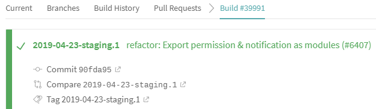

# Wire™

[](https://wire.softgarden.io/job/616102)

This repository is part of the source code of Wire. You can find more information at [wire.com](https://wire.com) or by contacting opensource@wire.com.

You can find the published source code at [github.com/wireapp/wire](https://github.com/wireapp/wire).

For licensing information, see the attached LICENSE file and the list of third-party licenses at [wire.com/legal/licenses/](https://wire.com/legal/licenses/).

If you compile the open source software that we make available from time to time to develop your own mobile, desktop or web application, and cause that application to connect to our servers for any purposes, we refer to that resulting application as an “Open Source App”. All Open Source Apps are subject to, and may only be used and/or commercialized in accordance with, the Terms of Use applicable to the Wire Application, which can be found at https://wire.com/legal/#terms. Additionally, if you choose to build an Open Source App, certain restrictions apply, as follows:

a. You agree not to change the way the Open Source App connects and interacts with our servers; b. You agree not to weaken any of the security features of the Open Source App; c. You agree not to use our servers to store data for purposes other than the intended and original functionality of the Open Source App; d. You acknowledge that you are solely responsible for any and all updates to your Open Source App.

For clarity, if you compile the open source software that we make available from time to time to develop your own mobile, desktop or web application, and do not cause that application to connect to our servers for any purposes, then that application will not be deemed an Open Source App and the foregoing will not apply to that application.

No license is granted to the Wire trademark and its associated logos, all of which will continue to be owned exclusively by Wire Swiss GmbH. Any use of the Wire trademark and/or its associated logos is expressly prohibited without the express prior written consent of Wire Swiss GmbH.

# How to build the open source client

## Build

### Installation

1. Install [Node.js](https://nodejs.org/)
1. Install [Yarn](https://yarnpkg.com)
1. Run `yarn`
1. Rename `.env.localhost` to `.env` in order to run the app in a local environment
1. Use a browser with disabled web security (`−−disable−web−security` in Chrome) to circumvent CORS issues when connecting to our backend from localhost

### Execution

Run `yarn start` and Wire's web app will be available at: https://localhost:8081/auth/

### Testing

To launch the full test suite (types check + linting + server tests + app tests), simply run:

`yarn test`

Alternatively, you can test specific parts of the app:

`yarn test:(server|types|app)`

### Development

Bypass Chrome's security restrictions for local development:

1. Add the following entries to your hosts file: `127.0.0.1 local.wire.com` (to connect with production backend) and `127.0.0.1 local.zinfra.io` (to connect with staging backend)
1. Restart your Chrome browser with flags: `--disable-web-security --ignore-certificate-errors --user-data-dir=...`
1. Run `yarn start`

Host file location:

- On macOS / Linux the hosts file can be found at: `/etc/hosts`
- On Windows 10 the hosts file can be found at: `%WINDIR%\system32\drivers\etc\hosts`

Optional: If your browser does not trust the certificate from "local.wire.com" or "local.zinfra.io":

1. Download [mkcert](https://github.com/FiloSottile/mkcert/releases/latest)
1. Set `CAROOT` env variable to `./server/certificate`
1. Run `mkcert -install`

### Deployment

#### General workflow

| Stage | Branch | Action | Environment | Backend |
| :-: | :-: | :-: | :-: | :-- |
| 1 (Feature development) | edge | commit | [wire-webapp-edge](https://wire-webapp-edge.zinfra.io/) | Staging |
| 2 (Nightly test automation) | dev | commit or squash merge from edge | [wire-webapp-dev](https://wire-webapp-dev.zinfra.io/) | Staging |
| 3 (Internal release) | dev | tag (format: YYYY-MM-DD-staging.X) | [wire-webapp-staging](https://wire-webapp-staging.wire.com/) | Production |
| 4 (RC testing) | master | merge (don't squash) from "dev"; afterwards [generate release notes](#release-notes) | [wire-webapp-master](https://wire-webapp-master.zinfra.io/) | Staging |
| 5 (Production release) | master | tag (format: YYYY-MM-DD-production.X) | [wire-webapp-prod](https://app.wire.com/) | Production |

#### Staging Bumps for internal releases

**Actions**

1. Get commit ID which has been approved by QA team
1. run `yarn release:staging <commitId>` (if the commit ID is omitted, the latest commit from `dev` will be used).
1. Example:
   ```
   yarn release:staging 90fda951916f0d60a5bffce69a7267830e313391
   ```
1. Enter "yes"

If everything is done right, you will see a Travis CI job in the [build pipeline](https://travis-ci.org/wireapp/wire-webapp/builds) based on the new tag:



#### RC testing

Before RC testing we create a merge commit (**don't squash!**) from "dev" to "master" branch, so that our QA team can run tests on the latest version of our app.

#### Production Release

Similar to "Staging Bumps" with the exception that you need to run `yarn release:production <commitId>` (if the commit ID is omitted, the latest commit from `master` will be used).

Example:

```
yarn release:production 90fda951916f0d60a5bffce69a7267830e313391
```

##### Release notes

Release notes need to be generated with `yarn changelog` after merging to "master" and before creating the new production release tag. Release notes will be locally available (not committed to the repository) in [CHANGELOG.md](./CHANGELOG.md) and sent to our marketing team to create release notes on [Medium](https://medium.com/wire-news/desktop-updates/home).

#### Manual Deployments

Based on the git branch, builds get deployed automatically by [Travis CI](https://travis-ci.org/). In case Travis CI is not working, a manual deployment can be triggered using `yarn deploy`.

A manual deployment requires the local setup of the Elastic Beanstalk Command Line Interface ([EB CLI](https://docs.aws.amazon.com/en_us/elasticbeanstalk/latest/dg/eb-cli3.html)). Manual deployments are also based on branch defaults which are configured [here](./.elasticbeanstalk/config.yml).

### Status

[](https://travis-ci.org/wireapp/wire-webapp) [](https://github.com/prettier/prettier)

### Translations

All Wire translations are crowdsourced via [Crowdin](https://crowdin.com/projects/wire).

#### Add new strings

**Info:**

- To download translations we use Crowdin API v1, and you need to setup your [username](https://crowdin.com/settings#account) and [api_key](https://crowdin.com/settings#api-key) (Account API key).
- To upload translations we use Crowdin CLI v3, and you will need to setup [project_identifier](https://crowdin.com/project/wire-webapp/settings#api) and [api_token](https://crowdin.com/settings#api-key) (Personal Access Token).

**Setup:**

Create a `keys/crowdin.yaml` in this repository and add the following entries:

```yaml
api_key: your-account-api-key
api_token: your-personal-access-token
project_identifier: wire-webapp
username: your-username
```

**Usage:**

1. Install [Crowdin CLI v3](https://support.crowdin.com/cli-tool/)
1. Verify you have a `keys/crowdin.yaml` in place
1. Run `yarn translate:download`
1. Add string variable and text to "i18n/en-US.json"
1. Run `yarn translate:upload`
1. Verify your string shows up on [Crowdin project: wire-webapp](https://crowdin.com/translate/wire-webapp/1224/en-en)
1. Add translation on Crowdin
1. Approve translation on Crowdin
1. Run `yarn translate:download`

### Contributing

Contributions are welcome! Feel free to check our [issues page](https://github.com/wireapp/wire-webapp/issues).

The following commits will help you getting started quickly with our code base:

- [Show a modal / pop-up](https://github.com/wireapp/wire-webapp/commit/00d3d120aacb3f36da80edd1ca829afc045331e9)
- [Sync setting between via backend](https://github.com/wireapp/wire-webapp/commit/3e4595a208189b7b6b51935fd2c41a74bbd16994)
