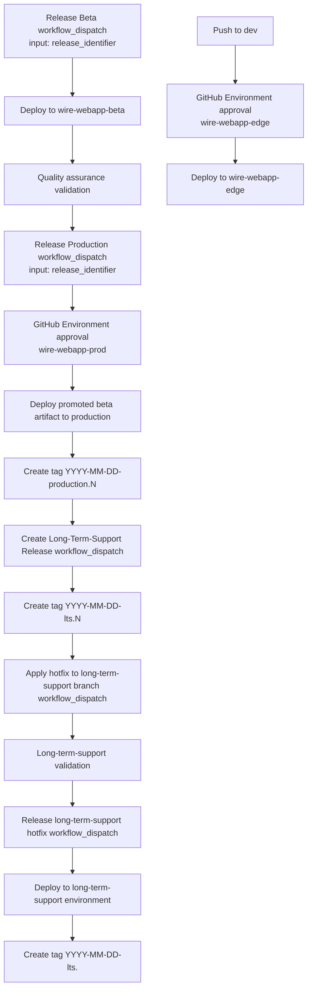

# 0002: Fully Automated, Quality Assurance-Gated Release Process with ISO-Date Identifiers

## Status

Proposed

## Context

The current release process is mostly driven by branch and tag pushes, with production deployment triggered by pre-existing production tags. That creates two main problems:

- Production tags are created before production deployment, which makes the tag represent intent rather than a verified deployment result.
- The process does not provide a clean and auditable promotion flow from beta validation to production deployment.

We want a release process that is fully executable from GitHub Actions without manual release operations on local developer machines. We also need a controlled promotion model where quality assurance validates on beta and then explicitly triggers production.

At the same time, we need to keep internal dogfooding on Edge while reducing surprise deployments, and we need a clear hotfix path during long quality assurance windows. Finally, on-premise customers require a lower long-term-support release cadence than cloud environments.

```mermaid
flowchart LR
  developmentBranch[dev]
  stableBranch[master]
  releaseBranch[release/YYYY-MM-DD.N]
  productionTag[YYYY-MM-DD-production.N]
  longTermSupportBranch[lts/YYYY-MM-DD.N]
  longTermSupportTag[YYYY-MM-DD-lts.N]
  longTermSupportHotfixTag[YYYY-MM-DD-lts.<next-sequence>]

  developmentBranch -->|Promote selected changes| stableBranch
  stableBranch -->|Cut release branch| releaseBranch
  releaseBranch -->|Deploy after quality assurance approval| productionTag
  productionTag -->|Create long-term-support branch and snapshot| longTermSupportBranch
  longTermSupportBranch -->|Create long-term-support tag| longTermSupportTag

  hotfixCommit[Hotfix commit merged to master] -->|Cherry-pick -x via workflow| releaseBranch
  hotfixCommit -->|Cherry-pick -x via workflow| developmentBranch
  hotfixCommit -->|Cherry-pick -x via workflow| longTermSupportBranch
  longTermSupportBranch -->|Deploy long-term-support hotfix and tag| longTermSupportHotfixTag
```

### Alternatives

- Keep release triggers primarily tag-driven for production deployments.
- Keep automatic Edge deployments without additional approval gates.
- Handle hotfix propagation manually on local machines.
- Use sequence-only release names such as `YYYY.N`.

## Decision

We will adopt a fully automated, GitHub-driven release process with explicit beta-to-production promotion and post-deployment production tagging.

The release process will use ISO-date identifiers in UTC with same-day sequence numbers: `YYYY-MM-DD.N`.
Sequence numbers are determined by workflow automation from existing tags for the same UTC date, and workflows must fail on sequence conflicts.

The process is:

- A release branch is cut from `master` as `release/YYYY-MM-DD.N`.
- `Release Beta` is triggered manually through GitHub Actions using `release_identifier`.
- Quality assurance validates the deployment in beta.
- `Release Production` is triggered manually through GitHub Actions using the same `release_identifier`.
- Production deployment is protected by a GitHub Environment approval gate for quality assurance reviewers.
- Only quality assurance members may approve the production environment and trigger the production release workflow.
- The production workflow promotes the matching beta artifact and does not rebuild.
- After successful production deployment, the workflow creates production tag `YYYY-MM-DD-production.N`.

We will keep continuous deployment to Edge from `dev`, but deployment execution will be gated by GitHub Environment approval.

Hotfix propagation will be automated and GitHub-only:

- Hotfixes are merged to `master`.
- A dedicated workflow applies `git cherry-pick -x` to the active `release/YYYY-MM-DD.N` branch and to `dev`.
- The workflow creates pull requests for both targets to keep traceability and reviewability.

For on-premise distribution, we will maintain a separate long-term-support line with a lower scheduled cadence, using explicit long-term-support tags created from approved production tags.

Long-term-support hotfixes will use dedicated maintenance branches:

- Each long-term-support release creates `lts/YYYY-MM-DD.N` from the corresponding approved production state.
- Hotfixes are merged to `master` first and then propagated via workflow to `dev` and the affected `lts/YYYY-MM-DD.N` branch with `git cherry-pick -x`.
- Long-term-support hotfix deployments are triggered from the long-term-support branch, not from `dev` or active cloud release branches.
- A new long-term-support tag is created only after successful long-term-support hotfix deployment using numeric sequence increments, for example `YYYY-MM-DD-lts.0`, `YYYY-MM-DD-lts.1`, `YYYY-MM-DD-lts.2`.

## Consequences

This decision improves release traceability and operational safety by making production tags represent successful deployments.

Quality assurance gains a simple, fully clickable workflow with clear promotion control, and developers no longer need local release/tagging interactions.

The release model introduces additional workflow definitions and release metadata handling, but this complexity is explicit, auditable, and contained in automation.

Hotfix handling during quality assurance windows becomes predictable and branch-safe, while Edge remains available for dogfooding with an added approval safeguard.

Long-term-support customers can receive controlled, low-frequency releases without constraining cloud release cadence.
