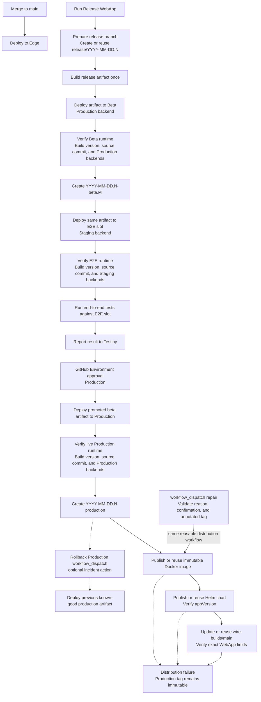

# 0002: Use a Trunk-Based Automated Release Process

## Status

Accepted

## Context

The current release process is mostly driven by branch and tag pushes, with production deployment triggered by pre-existing production tags. That creates two main problems:

- A successful Production deployment operation alone is not sufficient evidence for an immutable Production tag; without live verification, the tag can represent intent rather than a verified runtime.
- The process does not provide a clean and auditable promotion flow from beta validation to production deployment.

We want a release process that is fully executable from GitHub Actions without manual release operations on local developer machines. We also want fewer long-lived branches, fewer synchronization steps, and clearer ownership for quality approval, production rollout, observability, rollback, and customer-specific maintenance releases.

Today, `dev` and `master` both carry release meaning. That creates avoidable complexity: changes can need promotion from `dev` to `master`, hotfixes can need backports from `master` to `dev`, and it is not obvious which branch is the single source of truth. The new process should make the branch model easy to understand:

- `main` is the trunk branch.
- Edge is for immediate internal dogfooding from trunk.
- Beta is for release-candidate validation from release branches.
- Production is for customer traffic and only receives beta-tested artifacts.
- On-premises maintenance releases are created only when needed for customer-managed deployments.

```mermaid
flowchart LR
  mainBranch[main]
  edgeEnvironment[Edge]
  hostedDevEnvironment[Hosted Dev<br/>Staging backend]
  developmentDistribution[Publish dev Docker image and Helm chart<br/>Update wire-builds/dev]
  runReleaseWebApp[Run Release WebApp]
  prepareReleaseBranch[Prepare release branch<br/>Resolve one exact source commit]
  releaseBranch[release/YYYY-MM-DD.N]
  releaseArtifact[Release artifact]
  betaEnvironment[Beta company validation<br/>Production backend]
  e2eEnvironment[E2E validation slot<br/>Staging backend]
  productionApproval[Quality assurance approval]
  betaTag[YYYY-MM-DD.N-beta.M]
  productionEnvironment[Production]
  productionRuntimeVerification[Verify live Production runtime<br/>Artifact version and Production backends]
  productionTag[YYYY-MM-DD.N-production]
  productionDistribution[Publish Docker image and Helm chart<br/>Update wire-builds/main]
  manualDistributionRepair[Manual distribution repair<br/>Validate confirmation, reason, and tag]
  maintenanceBranch[maintenance/maintenance-line-key]
  maintenanceTag[maintenance-line-key-maintenance.X]

  mainBranch -->|Every eligible delivery deploys| edgeEnvironment
  mainBranch -->|Every eligible delivery deploys| hostedDevEnvironment
  mainBranch -->|Publish development distribution| developmentDistribution
  runReleaseWebApp --> prepareReleaseBranch --> releaseBranch
  releaseBranch -->|Build once| releaseArtifact
  releaseArtifact -->|Deploy| betaEnvironment
  betaEnvironment -->|Verify Production runtime| betaTag
  betaTag -->|Deploy same artifact| e2eEnvironment
  e2eEnvironment -->|E2E and Testiny succeed| productionApproval
  productionApproval -->|Approve candidate| productionEnvironment
  productionEnvironment -->|Deploy promoted artifact| productionRuntimeVerification
  productionRuntimeVerification -->|Verified runtime creates| productionTag
  productionTag -->|Explicit reusable workflow| productionDistribution
  manualDistributionRepair -->|Explicit reusable workflow| productionDistribution
  productionTag -->|Create only when needed| maintenanceBranch
  maintenanceBranch -->|Validated maintenance artifact creates| maintenanceTag

  hotfixCommit[Hotfix merged to main] -->|Cherry-pick through reviewed pull request| releaseBranch
  hotfixCommit -->|Cherry-pick through reviewed pull request| maintenanceBranch
```

### Alternatives

- Keep `dev` and `master` as separate long-lived branches.
- Keep release triggers primarily tag-driven for production deployments.
- Require a manual GitHub Actions dispatch for beta deployments.
- Gate Edge deployments with GitHub Environment approval.
- Keep using the term "long-term-support release" for customer-specific maintenance releases.
- Handle hotfix propagation directly on local developer machines.

## Decision

We will adopt a trunk-based, GitHub-driven WebApp release process with `Release WebApp` as the single normal-release entrypoint, explicit quality assurance approval before hosted Production, and post-deployment Production tagging.

### Environment audiences and stability expectations

Edge is the Web team's immediate dogfooding environment. Every eligible change merged to `main` may appear on Edge. Because Edge continuously follows trunk, it provides no stability guarantee and may include incomplete, experimental, or recently merged changes protected by feature flags. It is not intended to be stable enough for broader company-wide daily use.

Hosted Dev is the historical hosted development frontend at `https://wire-webapp-dev.zinfra.io/`. Every eligible `main` delivery deploys the same internal artifact to Hosted Dev that it deploys to Edge. Hosted Dev connects to the Staging REST and WebSocket backend services at `https://staging-nginz-https.zinfra.io/` and `wss://staging-nginz-ssl.zinfra.io/`, respectively.

Beta is the logical release stage for company-wide internal release-candidate validation. It follows an active release branch rather than trunk and should be stable enough for broader daily internal use. Beta represents the current candidate for the next Production release. Beta uses the `wire-webapp-beta` GitHub Environment and its canonical company-facing URL is `https://wire-webapp-beta.wire.com/`. Beta continues to deploy physically to the existing `wire-webapp-staging` Elastic Beanstalk environment. The physical AWS environment name is retained temporarily and is separate from the GitHub Environment name.

Beta preserves the previous company-facing Staging release-candidate behavior: it connects to Production backend services, and employees validate it with their normal Production accounts and data. The legacy physical name `wire-webapp-staging` describes infrastructure only; it does not mean that the company-facing Beta frontend uses Staging backend services.

Automated E2E must never run against Production backend services or create test users in Production. The release workflow deploys the exact Beta artifact to the dedicated `wire-webapp-precommit-3` validation environment, verifies that its runtime configuration uses Staging backend services, then runs E2E there with disposable Staging users and test data. Beta, precommit validation, and Production use the same built artifact; their differences are runtime environment configuration, not rebuilt application artifacts.

A Beta candidate may be promoted when validation is complete and no known release-blocking issues remain. Production receives only the exact artifact validated on Beta. Production promotion remains an explicit decision through GitHub Environment approval; the absence of reported issues does not automatically deploy Beta to Production.

The branch model is:

- `main` is the single trunk branch and the source for Edge and hosted Dev deployments.
- During the migration, `main` was established from the active `dev` history because `dev` contained the current development history at cutover time.
- `dev` and `master` are legacy branches retained temporarily for compatibility and old release-path retirement; normal development no longer targets either branch.
- `Release WebApp` creates a missing `release/YYYY-MM-DD.N` branch from one exact source commit or reuses the existing branch head without moving it.
- Removing the legacy branches is a later operational cleanup decision.
- On-premises maintenance branches are created only when a customer-managed release line needs maintenance after the original production release.

The release identifier uses the release branch name: `YYYY-MM-DD.N`. The full identifier is anchored to the release branch, not to the later deployment date. For example, updates to `release/2026-05-05.1` always create tags in the `2026-05-05.1` family, even if a hotfix is added on a later day.

The WebApp release process is:

- `Release WebApp` is the single user-facing normal-release entrypoint. The release captain supplies a release identifier in `YYYY-MM-DD.N` format; the workflow derives `release/YYYY-MM-DD.N` and performs branch preparation, hosted deployment, validation, approval, and release distribution.
- When the derived release branch does not exist, `Release WebApp` resolves the requested `source_ref` to one exact remote commit, creates the branch at that commit without force-pushing, refetches it, and verifies the resulting remote head. If another run wins the creation race, the workflow resolves and reuses the actual remote branch.
- When the derived release branch already exists, its current remote head is authoritative. The workflow reuses that branch without moving it to `source_ref`, current `main`, or any other commit. Reviewed fixes may therefore update an active release branch before a later candidate run.
- Repeated dispatches with the same identifier reuse the release branch and build its current head, producing subsequent Beta candidates such as `YYYY-MM-DD.N-beta.2`. A new identifier is required to release a newer state of `main`.
- Hosted Beta and hosted Production are deployment stages operated by Wire. E2E remains a blocking release gate, and Production approval remains explicit through the `wire-webapp-prod` GitHub Environment.
- Docker, Helm, and `wire-builds/main` form the release distribution consumed by hosted and customer-managed deployments. Release distribution is part of the complete WebApp release lifecycle, not merely a hosted deployment detail.
- The standalone branch-creation workflow no longer exists; automatic release-branch triggering remains disabled during the transition.

- `publish-main.yml` owns delivery of every eligible `main` commit. It builds the internal application exactly once, then deploys that same internal artifact to Edge and hosted Dev. Edge remains the immediate trunk dogfooding environment.
- The development distribution retains the external channel name `dev`: it publishes the Docker image and a matching prerelease Helm chart, then updates `wire-builds/dev`.
- `wire-builds/dev` remains the development distribution consumed by downstream internal integration environments; it is separate from the hosted Dev frontend deployment.
- The legacy `publish-and-deploy-webapp.yml` workflow no longer owns `dev`; its `dev` branch trigger is not restored.
- `wire-builds/main` remains Production-only and is never updated by an ordinary `main` push.
- Development and Production distributions share the same Helm repository and prerelease version namespace. Their Docker, Helm, and `wire-builds` publications use one shared, non-cancellable distribution lock.
- Edge verifies that its artifact still belongs to the current `main` commit after acquiring the deployment slot; stale Edge builds skip instead of moving Edge backwards.
- Hosted Dev verifies that its artifact still belongs to the current `main` commit after acquiring its deployment slot; stale Hosted Dev builds skip instead of moving Hosted Dev backwards.
- Development, verified Production, and remaining legacy distribution paths share one non-cancellable queued publication group with `queue: max`, which preserves pending publications until the legacy workflow is deleted.
- Every merge to `main` deploys continuously to Edge without an approval gate. A newer `main` commit may supersede an in-progress Edge deployment.
- A stale queued main publication checks the current `main` commit after acquiring the shared distribution lock and skips before external publication instead of regressing the shared `dev` channel.
- `Release WebApp` deploys the exact prepared release commit and artifact to hosted Beta, creates a beta tag such as `YYYY-MM-DD.N-beta.1`, and deploys that same artifact to the dedicated E2E validation environment connected to Staging backend services.
- Beta tag numbers are derived from existing beta tags for the release identifier. If concurrent workflows try to create the same tag for different commits, the later workflow must fail and be rerun after fetching the latest tags.
- The workflow runs E2E there and reports the result to Testiny.
- The complete selected release E2E suite is a blocking full-system Production gate. The suite is not split into blocking and advisory tests, and no selected release E2E test uses `continue-on-error` or a flaky-test quarantine.
- This gate intentionally validates the complete Wire system: frontend, backend, infrastructure, and integration failures may all block Production because customers consume the whole system.
- Test implementation defects are fixed as test defects; known instability is not converted into `continue-on-error`.
- Temporary system outages require investigation and a manual decision on whether to rerun. Failed tests may be manually rerun only after investigation; automatic test reruns are not part of the release decision.
- Successful E2E and Testiny reporting are required before Production promotion.
- Production preflight is not allowed after any E2E failure, and QA approval cannot override a technically failed E2E gate in this workflow.
- Failed release gates use the WebApp release failure notification with stage evidence and Playwright report links when available.
- After a successful E2E gate and Production preflight, `Release WebApp` notifies Deployoholics that the candidate passed and reports whether hosted Production is ready for approval, unnecessary because the release is already tagged, or not requested. Notification delivery is informational and does not gate the release. The reusable precommit workflow's optional failure notification remains disabled to prevent duplicate failure messages.
- The production deployment job waits for GitHub Environment approval on the production environment.
- GitHub Environment approval means the workflow pauses before using the production environment until configured reviewers approve or reject the deployment in GitHub.
- Quality assurance owns the go/no-go quality gate.
- The engineering release captain owns production rollout, observability, and incident response.
- The production workflow promotes the beta-tested artifact and does not rebuild from source.
- Live deployment verification uses `/version` to identify the deployed artifact with its complete authoritative `BuildMetadata` object (`version`, `assetVersion`, `commit`, and `builtAt`), and `/config.js` to verify the active environment-specific REST and WebSocket backend configuration.
- `version` remains the logical application version, `assetVersion` identifies browser assets for the exact source revision, `commit` is the full Git SHA, and `builtAt` is the artifact assembly time in UTC. `/commit` remains a plain-text compatibility endpoint for existing consumers.
- Deployment context such as the result, Git reference, target environment, service URLs, Docker image, Helm chart, `wire-builds` commit, workflow run URL, and manual-dispatch reason belongs in GitHub Actions summaries rather than `/version`.
- Backend configuration is runtime state and is not inferred from build identity. Beta, precommit, and Production must each satisfy their expected combination of build version, source commit, REST backend, and WebSocket backend.
- A successful deployment operation alone does not create a Production tag. The workflow creates the production tag `YYYY-MM-DD.N-production` only after all Production runtime assertions pass, so the tag represents a successfully deployed and verified runtime.
- The hosted-deployment EBS artifact is built once and promoted unchanged through hosted Beta, E2E, and hosted Production.
- A Production-capable run also preserves the exact public build outputs needed by the Dockerfile. The public Docker image is built from those outputs, from the same release commit, without rebuilding the application.
- Docker and Helm publication starts only after Production deployment and runtime verification succeed and the immutable Production tag has been created.
- `wire-builds/main` is updated only after the immutable image and Helm chart have been published or reused and verified.
- A Production tag represents verified hosted Production deployment. The release is fully distributed only after the `wire-builds/main` update succeeds.
- A distribution failure does not move or delete the Production tag. The WebApp release run remains failed and identifies the release as incomplete for customer-managed distribution.
- A dedicated reusable distribution workflow is called explicitly by `Release WebApp` after the immutable Production tag exists. A separate manual repair workflow validates confirmation, reason, and the existing annotated Production tag before calling the same reusable workflow for a partial distribution failure. Publication is not triggered by a tag listener.
- Docker, Helm, and `wire-builds/main` publication is retry-safe and idempotent. Existing immutable image and chart identities are reused, and an exact `wire-builds` entry is a no-op.
- The current WebApp distribution policy is preserved: when no matching chart exists, Helm publication uses the prerelease chart version sequence consumed by `wire-builds/main`.
- A `wire-builds/main` update may change only the top-level `version` and `helmCharts.webapp`; every other field and chart entry must remain byte-for-byte equivalent after normalized JSON comparison.
- If Production runtime verification fails, Production remains untagged, the release workflow fails, Deployoholics receives a failure notification, and the release captain performs incident assessment.
- If the current release branch commit already has the matching production tag, the release workflow must not redeploy that commit.
- Production tags are immutable release history and are never moved or deleted.
Release workflows must be serialized:

- Only one Beta deployment may run at a time for a given release branch.
- A newer Beta run for the same release branch may cancel an older in-progress Beta run before deployment starts.
- Only one Production deployment may run at a time for the repository.
- Production deployments must not be cancelled automatically.
- The repository-wide Production lock covers deployment, runtime verification, Production tag creation, Docker publication, Helm publication, and the `wire-builds/main` update. Manual distribution repairs use the same lock.
- WebApp releases, Production rollbacks, and Production distribution repairs use the same non-cancellable concurrency group with `queue: max` so pending Production operations are preserved rather than replaced.

- Release workflow failures and stalled approvals are monitored by the engineering release captain and announced in Wire.

Hotfix handling will be pull-request based:

- Hotfixes are merged to `main` first.
- Fixes needed in an active release branch are cherry-picked into that release branch through a reviewed pull request.
- Fixes needed in an on-premises maintenance branch are cherry-picked into that maintenance branch through a reviewed pull request.
- Automation may help create cherry-pick pull requests, but cherry-pick conflicts must stop the automation and require manual resolution in the pull request.
- Direct pushes to release and maintenance branches are not part of the normal process.

On-premises maintenance releases replace the previous "long-term-support release" wording:

- Not every production release becomes an on-premises maintenance line.
- A maintenance line is created only when a customer-managed deployment needs a stable branch for later patches.
- Maintenance branch names use a non-sensitive maintenance line key, for example `maintenance/2026-05-05.1-airgap-a`.
- The webapp team produces the branch, artifact, and tags; customer deployment is handled outside this workflow by the integration or customer deployment process.
- Maintenance branches do not implicitly deploy to the normal Beta or Production environments.
- Maintenance validation happens in a dedicated maintenance validation path before a maintenance artifact is handed off.

Branch and tag cleanup follows these rules:

- Release branches may be deleted after the production tag exists and the agreed retention window has passed.
- Maintenance branches stay while the corresponding maintenance line is supported.
- Release, beta, production, and maintenance tags are immutable and must not be deleted as part of routine cleanup.

Rollback will be first-class:

- Production rollback is performed through a dedicated GitHub Actions workflow as a separate explicit operation; runtime verification failure does not automatically roll back.
- The rollback workflow deploys a previous known-good production tag or artifact.
- Rollback is owned by engineering release owners, not quality assurance.
- A rollback requires a reason, a Wire notification, and, when applicable, an incident reference.
- Rollback does not delete, move, or rewrite release tags. Runtime state must be visible through GitHub deployment metadata, deployment logs, and notifications.

Feature flags are required for trunk-based development:

- Incomplete or risky work must be hidden behind feature flags before it is merged to `main`.
- Release branches validate the intended feature flag state for that release.
- Feature flags are not automatically removed before merging to `main`.
- A feature may be merged to `main` behind a disabled flag, enabled on Edge for dogfooding, and later enabled for Beta and Production when it is part of the release scope.
- Feature flag removal is a separate cleanup step after the feature is fully rolled out and no rollback-by-flag is needed anymore.
- Edge may expose trunk changes earlier than Beta and Production by design.

## Consequences

This decision improves release traceability and operational safety by making production tags represent successful deployments.

The branch model becomes simpler: `main` is trunk, Edge follows trunk, and Beta and Production are tied to release branches.

The process removes the `dev` to `master` promotion step and the `master` to `dev` backport step, reducing synchronization mistakes and cognitive load.

Quality assurance gains a clear quality gate without owning production operations. Engineering keeps ownership of production rollout, observability, incident response, and rollback.

The process depends more strongly on pull request discipline and feature flag usage because `main` continuously deploys to Edge.

The legacy monolithic workflow no longer owns `dev` publication; it remains only for its legacy tag, `master`, and maintenance paths until those responsibilities are retired.

On-premises customers can receive controlled maintenance artifacts without making every production release a long-term-support line or constraining the WebApp release cadence.
