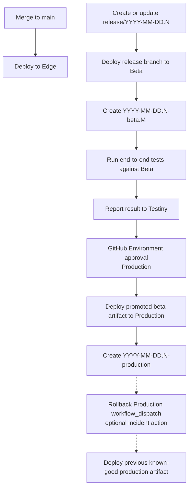

# 0002: Use a Trunk-Based Automated Release Process

## Status

Proposed

## Context

The current release process is mostly driven by branch and tag pushes, with production deployment triggered by pre-existing production tags. That creates two main problems:

- Production tags are created before production deployment, which makes the tag represent intent rather than a verified deployment result.
- The process does not provide a clean and auditable promotion flow from beta validation to production deployment.

We want a release process that is fully executable from GitHub Actions without manual release operations on local developer machines. We also want fewer long-lived branches, fewer synchronization steps, and clearer ownership for quality approval, production rollout, observability, rollback, and customer-specific maintenance releases.

Today, `dev` and `master` both carry release meaning. That creates avoidable complexity: changes can need promotion from `dev` to `master`, hotfixes can need backports from `master` to `dev`, and it is not obvious which branch is the single source of truth. The new process should make the branch model easy to understand:

- `main` is the trunk branch.
- Edge is for immediate internal dogfooding from trunk.
- Beta is for release-candidate validation from release branches.
- Production is for customer traffic and only receives beta-tested artifacts.
- On-premises maintenance releases are created only when needed for customer-managed deployments.

```mermaid
flowchart LR
  mainBranch[main]
  edgeEnvironment[Edge]
  releaseBranch[release/YYYY-MM-DD.N]
  betaEnvironment[Beta]
  betaTag[YYYY-MM-DD.N-beta.M]
  productionEnvironment[Production]
  productionTag[YYYY-MM-DD.N-production]
  maintenanceBranch[maintenance/maintenance-line-key]
  maintenanceTag[maintenance-line-key-maintenance.X]

  mainBranch -->|Every merge deploys| edgeEnvironment
  mainBranch -->|Create release branch| releaseBranch
  releaseBranch -->|Every update deploys| betaEnvironment
  betaEnvironment -->|Successful beta deployment creates| betaTag
  betaEnvironment -->|Quality assurance approves| productionEnvironment
  productionEnvironment -->|Successful production deployment creates| productionTag
  productionTag -->|Create only when needed| maintenanceBranch
  maintenanceBranch -->|Validated maintenance artifact creates| maintenanceTag

  hotfixCommit[Hotfix merged to main] -->|Cherry-pick through reviewed pull request| releaseBranch
  hotfixCommit -->|Cherry-pick through reviewed pull request| maintenanceBranch
```

### Alternatives

- Keep `dev` and `master` as separate long-lived branches.
- Keep release triggers primarily tag-driven for production deployments.
- Require a manual GitHub Actions dispatch for beta deployments.
- Gate Edge deployments with GitHub Environment approval.
- Keep using the term "long-term-support release" for customer-specific maintenance releases.
- Handle hotfix propagation directly on local developer machines.

## Decision

We will adopt a trunk-based, GitHub-driven release process with automatic beta deployments from release branches, explicit quality assurance approval before production, and post-deployment production tagging.

The branch model is:

- `master` will be renamed to `main`.
- `dev` will be retired as a long-lived branch after workflows, branch protection rules, documentation, and external integrations are migrated.
- `main` is the single trunk branch and the source for Edge deployments.
- Release branches are cut from `main` as `release/YYYY-MM-DD.N`.
- On-premises maintenance branches are created only when a customer-managed release line needs maintenance after the original production release.

The release identifier uses the release branch name: `YYYY-MM-DD.N`. The full identifier is anchored to the release branch, not to the later deployment date. For example, updates to `release/2026-05-05.1` always create tags in the `2026-05-05.1` family, even if a hotfix is added on a later day.

The cloud release process is:

- Every merge to `main` deploys continuously to Edge without an approval gate.
- Creating or updating `release/YYYY-MM-DD.N` automatically starts the release workflow.
- The release workflow deploys the release branch to Beta.
- After a successful beta deployment, the workflow creates a beta tag such as `YYYY-MM-DD.N-beta.1`, `YYYY-MM-DD.N-beta.2`, and so on.
- Beta tag numbers are derived from existing beta tags for the release identifier. If concurrent workflows try to create the same tag for different commits, the later workflow must fail and be rerun after fetching the latest tags.
- The release workflow runs end-to-end tests against Beta and reports the result to Testiny.
- The production deployment job waits for GitHub Environment approval on the production environment.
- GitHub Environment approval means the workflow pauses before using the production environment until configured reviewers approve or reject the deployment in GitHub.
- Quality assurance owns the go/no-go quality gate.
- The engineering release captain owns production rollout, observability, and incident response.
- The production workflow promotes the beta-tested artifact and does not rebuild from source.
- After successful production deployment, the workflow creates the production tag `YYYY-MM-DD.N-production`.
- If the current release branch commit already has the matching production tag, the release workflow must not redeploy that commit.
- Production tags are immutable release history and are never moved or deleted.
Release workflows must be serialized:

- Only one Beta deployment may run at a time for a given release branch.
- A newer Beta run for the same release branch may cancel an older in-progress Beta run before deployment starts.
- Only one Production deployment may run at a time for the repository.
- Production deployments must not be cancelled automatically.

- Release workflow failures and stalled approvals are monitored by the engineering release captain and announced in Wire.

Hotfix handling will be pull-request based:

- Hotfixes are merged to `main` first.
- Fixes needed in an active release branch are cherry-picked into that release branch through a reviewed pull request.
- Fixes needed in an on-premises maintenance branch are cherry-picked into that maintenance branch through a reviewed pull request.
- Automation may help create cherry-pick pull requests, but cherry-pick conflicts must stop the automation and require manual resolution in the pull request.
- Direct pushes to release and maintenance branches are not part of the normal process.

On-premises maintenance releases replace the previous "long-term-support release" wording:

- Not every production release becomes an on-premises maintenance line.
- A maintenance line is created only when a customer-managed deployment needs a stable branch for later patches.
- Maintenance branch names use a non-sensitive maintenance line key, for example `maintenance/2026-05-05.1-airgap-a`.
- The webapp team produces the branch, artifact, and tags; customer deployment is handled outside this workflow by the integration or customer deployment process.
- Maintenance branches do not implicitly deploy to the normal Beta or Production environments.
- Maintenance validation happens in a dedicated maintenance validation path before a maintenance artifact is handed off.

Branch and tag cleanup follows these rules:

- Release branches may be deleted after the production tag exists and the agreed retention window has passed.
- Maintenance branches stay while the corresponding maintenance line is supported.
- Release, beta, production, and maintenance tags are immutable and must not be deleted as part of routine cleanup.

Rollback will be first-class:

- Production rollback is performed through a dedicated GitHub Actions workflow.
- The rollback workflow deploys a previous known-good production tag or artifact.
- Rollback is owned by engineering release owners, not quality assurance.
- A rollback requires a reason, a Wire notification, and, when applicable, an incident reference.
- Rollback does not delete, move, or rewrite release tags. Runtime state must be visible through GitHub deployment metadata, deployment logs, and notifications.

Feature flags are required for trunk-based development:

- Incomplete or risky work must be hidden behind feature flags before it is merged to `main`.
- Release branches validate the intended feature flag state for that release.
- Feature flags are not automatically removed before merging to `main`.
- A feature may be merged to `main` behind a disabled flag, enabled on Edge for dogfooding, and later enabled for Beta and Production when it is part of the release scope.
- Feature flag removal is a separate cleanup step after the feature is fully rolled out and no rollback-by-flag is needed anymore.
- Edge may expose trunk changes earlier than Beta and Production by design.

## Consequences

This decision improves release traceability and operational safety by making production tags represent successful deployments.

The branch model becomes simpler: `main` is trunk, Edge follows trunk, and Beta and Production are tied to release branches.

The process removes the `dev` to `master` promotion step and the `master` to `dev` backport step, reducing synchronization mistakes and cognitive load.

Quality assurance gains a clear quality gate without owning production operations. Engineering keeps ownership of production rollout, observability, incident response, and rollback.

The process depends more strongly on pull request discipline and feature flag usage because `main` continuously deploys to Edge.

On-premises customers can receive controlled maintenance artifacts without making every production release a long-term-support line or constraining the cloud release cadence.
