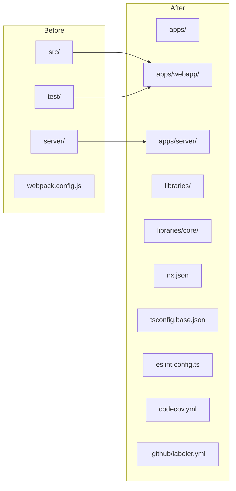
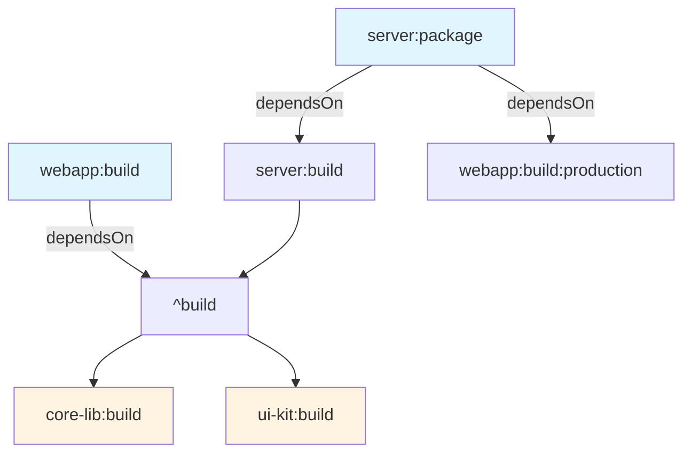

# Nx Monorepo Integration - Comprehensive Overview

## Table of Contents

- [Workspace-Tools Project](#workspace-tools-project)
- [Directory Structure Changes](#directory-structure-changes)
- [Configuration Files Overview](#configuration-files-overview)
- [Key Configuration Files Explained](#key-configuration-files-explained)
- [Adding a New App or Library](#adding-a-new-app-or-library)
- [Dependency Chain Setup](#dependency-chain-setup)
- [Nx Cache Configuration & Considerations](#nx-cache-configuration--considerations)
- [CI/CD Integration](#cicd-integration)
- [Local Development - Watching Libraries](#local-development---watching-libraries)
- [Quick Reference Commands](#quick-reference-commands)
- [Key Takeaways for Developers](#key-takeaways-for-developers)

---

## Workspace-Tools Project

The `workspace-tools` project is a special Nx project that provides workspace-level utilities. It doesn't have actual code to test or build - it's a container for shared scripts and commands.

**Available workspace-tools commands:**
- `nx run workspace-tools:clean-jest` - Clean Jest cache
- `nx run workspace-tools:changelog-production` - Generate production changelog
- `nx run workspace-tools:changelog-staging` - Generate staging changelog
- `nx run workspace-tools:changelog-rc` - Generate RC changelog
- `nx run workspace-tools:docker` - Build Docker image
- `nx run workspace-tools:release-staging` - Release to staging
- `nx run workspace-tools:release-production` - Release to production
- `nx run workspace-tools:release-custom` - Custom release

These commands are exposed as root npm scripts in [`package.json`](package.json:77-94):
```json
{
  "scripts": {
    "clean:jest": "nx reset && nx run workspace-tools:clean-jest",
    "changelog:production": "nx run workspace-tools:changelog-production",
    "changelog:staging": "nx run workspace-tools:changelog-staging",
    "changelog:rc": "nx run workspace-tools:changelog-rc",
    "deploy": "nx run server:package && eb deploy",
    "docker": "nx run workspace-tools:docker",
    "release:staging": "nx run workspace-tools:release-staging",
    "release:production": "nx run workspace-tools:release-production",
    "release:custom": "nx run workspace-tools:release-custom",
    "start": "nx serve server",
    "build:prod": "nx build webapp --configuration=production"
  }
}
```

---

## Directory Structure Changes

### Before vs After Migration



### Current Structure

```
wire-webapp/
├── apps/
│   ├── server/          # Node.js Express backend
│   └── webapp/          # React frontend
├── libraries/
│   └── core/            # Shared core library
├── .github/workflows/   # CI/CD workflows
├── .github/labeler.yml  # PR labeler configuration
├── bin/                 # Build scripts
├── charts/              # Helm charts
├── docs/                # Documentation (incl. ADRs)
├── nx.json              # Nx workspace configuration
├── package.json         # Root package.json (workspaces)
├── tsconfig.base.json   # Base TypeScript config
├── tsconfig.json        # Project references
├── tsconfig.eslint.json # ESLint TypeScript config
├── eslint.config.ts     # ESLint 9+ flat config
├── jest.preset.js       # Shared Jest preset
├── codecov.yml          # Codecov configuration
├── Jenkinsfile          # Jenkins deployment pipeline
└── .nx/                # Nx cache & workspace data
    ├── cache/            # Local cache storage
    └── workspace-data/   # Project graph data
```

---

## Configuration Files Overview

### Core Nx Configuration Files

| File | Purpose | Relevance to Monorepo |
|------|---------|----------------------|
| [`nx.json`](nx.json) | Nx workspace config, caching, target defaults | ⭐⭐⭐ Critical |
| [`tsconfig.base.json`](tsconfig.base.json) | Workspace-wide TypeScript config | ⭐⭐⭐ Critical |
| [`tsconfig.json`](tsconfig.json) | Project references | ⭐⭐⭐ Critical |
| [`tsconfig.eslint.json`](tsconfig.eslint.json) | TypeScript config for type-aware linting | ⭐⭐⭐ Critical |
| [`jest.preset.js`](jest.preset.js) | Shared Jest configuration | ⭐⭐⭐ Critical |
| [`eslint.config.ts`](eslint.config.ts) | ESLint 9+ flat config | ⭐⭐⭐ Critical |
| [`package.json`](package.json) | Root package with workspaces | ⭐⭐⭐ Critical |
| [`codecov.yml`](codecov.yml) | Codecov coverage configuration | ⭐⭐⭐ Critical |
| [`.github/labeler.yml`](.github/labeler.yml) | PR auto-labeling | ⭐⭐ High |

### Project-Specific Files

| File | Purpose |
|------|---------|
| [`apps/webapp/project.json`](apps/webapp/project.json) | Webapp Nx targets |
| [`apps/server/project.json`](apps/server/project.json) | Server Nx targets |
| [`libraries/core/project.json`](libraries/core/project.json) | Core library Nx targets |
| [`libraries/core/package.json`](libraries/core/package.json) | Library dependencies & type mappings |

---

## Key Configuration Files Explained

### [`nx.json`](nx.json) - Core Nx Configuration

```json
{
  "targetDefaults": {
    "build": {
      "dependsOn": ["^build"],  // Build all upstream dependencies first
      "cache": true,
      "inputs": ["production"],  // Skip test-only files
      "outputs": ["{projectRoot}/dist"]
    },
    "test": {
      "cache": true,
      "inputs": ["default", "^production", "{workspaceRoot}/jest.preset.js"]
    },
    "lint": {
      "cache": true,
      "inputs": ["default", "{workspaceRoot}/eslint.config.ts"]
    }
  },
  "namedInputs": {
    "default": ["{projectRoot}/**/*", "sharedGlobals"],
    "production": [
      "default",
      "!{projectRoot}/**/?(*.)+(spec|test).[jt]s?(x)?(.snap)",
      "!{projectRoot}/tsconfig.spec.json",
      "!{projectRoot}/jest.config.[jt]s",
      "!{projectRoot}/.eslintrc.json",
      "!{projectRoot}/src/test-setup.[jt]s",
      "!{projectRoot}/test-setup.[jt]s"
    ]
  },
  "defaultProject": "webapp"
}
```

**Key Points:**
- `dependsOn: ["^build"]` - Automatic dependency graph resolution
- `cache: true` - Nx caching enabled for build/test/lint
- `namedInputs` - Defines file sets for cache hashing

### [`tsconfig.base.json`](tsconfig.base.json) - Base TypeScript Config

```json
{
  "compilerOptions": {
    "baseUrl": ".",
    "paths": {
      "apps/*": ["apps/*"]
    }
  }
}
```

### [`tsconfig.eslint.json`](tsconfig.eslint.json) - Type-Aware Linting

```json
{
  "extends": "./tsconfig.base.json",
  "compilerOptions": {
    "noEmit": true,
    "paths": {
      "@wireapp/core/lib/*": ["libraries/core/src/*"],
      "@wireapp/core": ["libraries/core/src/index.ts"]
    }
  },
  "include": [
    "apps/webapp/src/**/*",
    "apps/webapp/test/**/*",
    "apps/server/**/*.ts",
    "libraries/core/src/**/*",
    "libraries/core/jest.setup.ts"
  ],
  "exclude": [
    "node_modules",
    "dist",
    "coverage",
    "tmp",
    "apps/server/dist",
    "apps/webapp/dist",
    "libraries/core/lib",
    "libraries/core/.tmp"
  ],
  "references": [
    { "path": "./apps/webapp" },
    { "path": "./apps/server" },
    { "path": "./libraries/core" }
  ]
}
```

**Why `paths` in [`tsconfig.eslint.json`](tsconfig.eslint.json:5-8) is critical for type-aware linting:**

The ESLint TypeScript Project Service (enabled via `EXPERIMENTAL_useProjectService` in [`eslint.config.ts`](eslint.config.ts:76-78)) needs to understand how to resolve module imports to provide accurate type checking during linting. Without these path mappings:

1. ESLint would fail to resolve imports like `import { ConnectionService } from '@wireapp/core/lib/connection'`
2. Type-aware rules would not work correctly
3. The `project` option in [`eslint.config.ts`](eslint.config.ts:74) points to this file, so paths defined here are used by TypeScript language service

### [`libraries/core/package.json`](libraries/core/package.json) - Library Configuration

```json
{
  "name": "@wireapp/core",
  "main": "lib/index",
  "types": "src/index.ts",
  "typesVersions": {
    "*": {
      "lib/*": [
        "src/*"
      ]
    }
  },
  "browser": {
    "./lib/cryptography/AssetCryptography/crypto.node": "./lib/cryptography/AssetCryptography/crypto.browser.js"
  }
}
```

**Why `typesVersions` in [`libraries/core/package.json`](libraries/core/package.json:12-17) is critical for libraries:**

The `typesVersions` field is a TypeScript feature that maps type resolution paths. It tells TypeScript that when someone imports from `lib/*` (e.g., `lib/connection`), it should resolve to `src/*` (e.g., `src/connection`). This is important because:

1. **Source-based types**: The library's type definitions are in `src/index.ts` (not in `lib/`)
2. **Compiled output**: The library compiles to `lib/` directory
3. **Import resolution**: When consumers import from the package, TypeScript needs to know that `lib/*` imports should resolve to source types for accurate IntelliSense and type checking

Without `typesVersions`, consumers would get type errors or no IntelliSense when importing subpaths like `@wireapp/core/lib/connection`.

### [`codecov.yml`](codecov.yml) - Coverage Configuration

```yaml
codecov:
  require_ci_to_pass: yes

  coverage:
    precision: 2
    round: down
    range: '45...80'
    status:
      project:
        default:
          target: auto
        app_webapp:
          target: auto
          flags:
            - app_webapp
        app_server:
          target: auto
          flags:
            - app_server
        lib_core:
          target: auto
          flags:
            - lib_core

  flags:
    app_webapp:
      paths:
        - 'apps/webapp/**'
      carryforward: false
    app_server:
      paths:
        - 'apps/server/**'
      carryforward: true
    lib_core:
      paths:
        - 'libraries/core/**'
      carryforward: true

  github_checks:
    annotations: false
```

### [`.github/labeler.yml`](.github/labeler.yml) - PR Auto-Labeling

```yaml
# Types
'type: refactoring 🛠':
  title: '^refactor(\(.+\))?:.*'
'type: bug / fix 🐞':
  title: '^(run)?fix(\(.+\))?:.*'
'type: chore 🧹':
  title: '^chore(\(.+\))?:.*'

# Apps
'app: webapp':
  files:
    - 'apps/webapp/.*'
'app: server':
  files:
    - 'apps/server/.*'

# Components
'comp: calling':
  files:
    - 'apps/webapp/src/script/repositories/calling/.*'
'comp: preferences':
  files:
    - 'apps/webapp/src/script/repositories/properties/.*'
'comp: infrastructure':
  files:
    - '.elasticbeanstalk'
    - '.github/.*'
```

---

## Adding a New App or Library

### Files to Modify/Add

#### For a New Application (e.g., `apps/new-app`)

| File | Action | Description |
|------|--------|-------------|
| [`apps/new-app/project.json`](apps/new-app/project.json) | **Create** | Nx project configuration |
| [`apps/new-app/package.json`](apps/new-app/package.json) | **Create** | App-specific dependencies |
| [`apps/new-app/tsconfig.json`](apps/new-app/tsconfig.json) | **Create** | TypeScript config |
| [`tsconfig.json`](tsconfig.json) | **Modify** | Add project reference |
| [`tsconfig.eslint.json`](tsconfig.eslint.json) | **Modify** | Add to include array |
| [`codecov.yml`](codecov.yml) | **Modify** | Add new flag for coverage |
| [`.github/labeler.yml`](.github/labeler.yml) | **Modify** | Add app label rule |

#### For a New Library (e.g., `libraries/new-lib`)

| File | Action | Description |
|------|--------|-------------|
| [`libraries/new-lib/project.json`](libraries/new-lib/project.json) | **Create** | Nx project configuration |
| [`libraries/new-lib/package.json`](libraries/new-lib/package.json) | **Create** | Library dependencies |
| [`libraries/new-lib/tsconfig.json`](libraries/new-lib/tsconfig.json) | **Create** | TypeScript config |
| [`tsconfig.json`](tsconfig.json) | **Modify** | Add project reference |
| [`tsconfig.eslint.json`](tsconfig.eslint.json) | **Modify** | Add to include array & paths |
| [`tsconfig.base.json`](tsconfig.base.json) | **Modify** | Add path mapping (optional) |
| [`codecov.yml`](codecov.yml) | **Modify** | Add new flag for coverage |
| [`.github/labeler.yml`](.github/labeler.yml) | **Modify** | Add library label rule |

### Example: New Library `libraries/ui-kit`

**Step 1: Create [`libraries/ui-kit/package.json`](libraries/ui-kit/package.json)**

```json
{
  "name": "@wireapp/ui-kit",
  "main": "lib/index",
  "types": "src/index.ts",
  "typesVersions": {
    "*": {
      "lib/*": [
        "src/*"
      ]
    }
  },
  "files": [
    "lib",
    "src"
  ]
}
```

**Step 2: Create [`libraries/ui-kit/project.json`](libraries/ui-kit/project.json)**

```json
{
  "name": "ui-kit",
  "$schema": "../../node_modules/nx/schemas/project-schema.json",
  "sourceRoot": "{projectRoot}/src",
  "projectType": "library",
  "targets": {
    "build": {
      "executor": "nx:run-commands",
      "outputs": ["{projectRoot}/lib"],
      "options": {
        "command": "tsc",
        "cwd": "{projectRoot}"
      }
    },
    "test": {
      "executor": "@nx/jest:jest",
      "outputs": ["{workspaceRoot}/coverage/libraries/ui-kit"],
      "options": {
        "jestConfig": "{projectRoot}/jest.config.js",
        "passWithNoTests": false
      }
    },
    "lint": {
      "executor": "nx:run-commands",
      "options": {
        "command": "eslint --quiet --ext .js,.ts {projectRoot}"
      }
    }
  },
  "tags": ["type:lib", "scope:ui"]
}
```

**Step 3: Update [`tsconfig.json`](tsconfig.json)**

```json
{
  "files": [],
  "references": [
    { "path": "./apps/webapp" },
    { "path": "./apps/server" },
    { "path": "./libraries/core" },
    { "path": "./libraries/ui-kit" }  // Add this
  ]
}
```

**Step 4: Update [`tsconfig.eslint.json`](tsconfig.eslint.json)**

```json
{
  "compilerOptions": {
    "paths": {
      "@wireapp/core/lib/*": ["libraries/core/src/*"],
      "@wireapp/core": ["libraries/core/src/index.ts"],
      "@wireapp/ui-kit": ["libraries/ui-kit/src/index.ts"],  // Add main import
      "@wireapp/ui-kit/lib/*": ["libraries/ui-kit/src/*"]  // Add subpath imports
    }
  },
  "include": [
    // ... existing includes
    "libraries/ui-kit/src/**/*"  // Add this
  ],
  "references": [
    // ... existing references
    { "path": "./libraries/ui-kit" }  // Add this
  ]
}
```

**Step 5: Update [`codecov.yml`](codecov.yml)**

```yaml
flags:
  # ... existing flags
  lib_ui_kit:
    paths:
      - 'libraries/ui-kit/**'
    carryforward: true

status:
  project:
    # ... existing projects
    lib_ui_kit:
      target: auto
      flags:
        - lib_ui_kit
```

**Step 6: Update [`.github/labeler.yml`](.github/labeler.yml)**

```yaml
# Libraries
'lib: ui-kit':
  files:
    - 'libraries/ui-kit/.*'
```

---

## Dependency Chain Setup

### Understanding `dependsOn`



### Dependency Examples

**Webapp depends on Core Library** (in [`apps/webapp/project.json`](apps/webapp/project.json:11)):

```json
{
  "build": {
    "dependsOn": ["^build", "server:build"]
  }
}
```

**Library depends on another Library** (in [`libraries/core/project.json`](libraries/core/project.json:17)):

```json
{
  "build": {
    "dependsOn": ["clean"]
  }
}
```

### Workspace Dependencies

In [`apps/webapp/package.json`](apps/webapp/package.json:40):

```json
{
  "dependencies": {
    "@wireapp/core": "workspace:^"
  }
}
```

The `workspace:^` protocol tells Yarn to resolve to the local workspace version.

### Viewing Dependency Graph

```bash
# View dependency graph
nx graph

# View affected projects
nx affected:graph

# List dependencies of a project
nx show project webapp --web=false

# Show project details with dependencies
nx show project webapp
```

---

## Nx Cache Configuration & Considerations

### Cache Configuration in [`nx.json`](nx.json)

```json
{
  "targetDefaults": {
    "build": {
      "cache": true,
      "outputs": ["{projectRoot}/dist"]
    },
    "test": {
      "cache": true,
      "outputs": ["{workspaceRoot}/coverage/apps/webapp"]
    },
    "lint": {
      "cache": true
    }
  }
}
```

### Cache Key Inputs

```json
{
  "namedInputs": {
    "default": ["{projectRoot}/**/*", "sharedGlobals"],
    "production": [
      "default",
      "!{projectRoot}/**/?(*.)+(spec|test).[jt]s?(x)?(.snap)",
      "!{projectRoot}/tsconfig.spec.json",
      "!{projectRoot}/jest.config.[jt]s",
      "!{projectRoot}/.eslintrc.json",
      "!{projectRoot}/src/test-setup.[jt]s",
      "!{projectRoot}/test-setup.[jt]s"
    ]
  }
}
```

### Important Cache Considerations

| Consideration | Details |
|---------------|---------|
| **Cache Location** | Local: `.nx/cache`, Remote: Nx Cloud (optional) |
| **Cache Invalidation** | Automatic based on file hashes |
| **Shared Files** | Add to `sharedGlobals` in [`nx.json`](nx.json:30) if they affect all projects |
| **Environment Variables** | Not included in cache by default - use `env` in inputs if needed |
| **CI Cache** | Use `nx reset` before CI runs to ensure clean state |
| **Cache Persistence** | Cache persists across sessions - use `nx reset` to clear |

### Cache Commands

```bash
# Reset cache (clears all cached artifacts)
nx reset

# Skip cache for a specific command
nx build webapp --skip-nx-cache

# View cache hits/misses
nx build webapp --verbose

# List cached tasks
nx show project webapp
```

### CI/CD Cache Integration

**GitHub Actions** ([`.github/workflows/ci.yml`](.github/workflows/ci.yml)):

```yaml
- name: Setup Node.js
  uses: actions/setup-node@v6
  with:
    node-version-file: '.nvmrc'
    cache: 'yarn'  # Yarn cache for node_modules
```

**Note**: Nx cache is local by default. For CI cache persistence, consider:
1. Nx Cloud for distributed caching
2. GitHub Actions cache for `.nx/cache` directory
3. Self-hosted cache storage

---

## CI/CD Integration

### GitHub Workflows Using Nx

| Workflow | Nx Commands Used |
|----------|------------------|
| [`ci.yml`](.github/workflows/ci.yml) | `nx run-many -t lint --all`, `nx run-many -t test --all` |
| [`precommit.yml`](.github/workflows/precommit.yml) | `nx run webapp:configure`, `nx run server:package` |
| [`publish.yml`](.github/workflows/publish.yml) | `nx run webapp:configure`, `nx run-many -t test --all`, `nx run server:package` |

### Codecov Upload in CI

From [`.github/workflows/ci.yml`](.github/workflows/ci.yml:39-60):

```yaml
- name: Upload webapp coverage to Codecov
  uses: codecov/codecov-action@v5.5.2
  with:
    fail_ci_if_error: false
    files: ./apps/webapp/coverage/lcov.info
    flags: app_webapp
    token: ${{ secrets.CODECOV_TOKEN }}

- name: Upload server coverage to Codecov
  uses: codecov/codecov-action@v5.5.2
  with:
    fail_ci_if_error: false
    files: ./apps/server/coverage/lcov.info
    flags: app_server
    token: ${{ secrets.CODECOV_TOKEN }}

- name: Upload core library coverage to Codecov
  uses: codecov/codecov-action@v5.5.2
  with:
    fail_ci_if_error: false
    files: ./coverage/libraries/core/lcov.info
    flags: lib_core
    token: ${{ secrets.CODECOV_TOKEN }}
```

### Common Nx CI Patterns

```bash
# Run all tests
nx run-many -t test --all --configuration=ci

# Run all linting
nx run-many -t lint --all

# Run affected projects only
nx affected -t build test lint

# Build specific configuration
nx build webapp --configuration=production
```

### Jenkins Integration

The [`Jenkinsfile`](Jenkinsfile) waits for GitHub Actions to complete:

```groovy
stage('Wait for GitHub action to finish') {
  when {
    expression { BRANCH_NAME ==~ /PR-[0-9]+/ }
  }
  steps {
    // Waits for GitHub workflow completion
  }
}
```

---

## Local Development - Watching Libraries

### Nx Watch Mode

Nx automatically watches all projects in the workspace. When you add a new library, Nx will automatically detect it and include it in the dependency graph.

```bash
# Start dev server with watch mode
nx serve webapp --watch

# Start multiple dev servers
nx run-many -t serve --parallel --watch
```

### TypeScript Path Mappings for Import Resolution

In [`tsconfig.eslint.json`](tsconfig.eslint.json:5-8), path mappings enable clean imports:

```json
{
  "compilerOptions": {
    "paths": {
      "@wireapp/core/lib/*": ["libraries/core/src/*"],
      "@wireapp/core": ["libraries/core/src/index.ts"]
    }
  }
}
```

This allows imports like:
```typescript
import { ConnectionService } from '@wireapp/core/lib/connection';
import { Account } from '@wireapp/core';
```

### Workspace Dependencies in package.json

In [`apps/webapp/package.json`](apps/webapp/package.json:40):

```json
{
  "dependencies": {
    "@wireapp/core": "workspace:^"
  }
}
```

The `workspace:^` protocol ensures:
- Local workspace packages are linked (no symlinks needed)
- Version is automatically resolved to the local workspace version
- Changes to the library trigger rebuilds of dependent projects

### Nx Daemon for Fast Rebuilds

Nx runs a daemon process that:
- Watches file changes
- Maintains the project graph in memory
- Provides instant dependency resolution

The daemon is located at `.nx/workspace-data/` and runs automatically.

---

## Quick Reference Commands

### Common Nx Commands

```bash
# Build
nx build <project>                    # Build specific project
nx run-many -t build --all           # Build all projects
nx affected -t build                  # Build affected projects

# Test
nx test <project>                     # Test specific project
nx run-many -t test --all             # Test all projects
nx test <project> --coverage          # Test with coverage

# Lint
nx lint <project>                     # Lint specific project
nx run-many -t lint --all             # Lint all projects

# Development
nx serve <project>                    # Start dev server
nx run-many -t serve --parallel       # Start multiple dev servers

# Graph & Analysis
nx graph                              # Visualize dependency graph
nx affected:graph                     # Show affected projects
nx show project <project>             # Show project details

# Cache
nx reset                              # Clear cache
```

### Project Tags

Projects use tags for organization:

```json
{
  "tags": ["type:app", "scope:frontend"]  // apps/webapp
  "tags": ["type:app", "scope:backend"]   // apps/server
  "tags": ["type:lib", "scope:core"]      // libraries/core
}
```

Run by tags:
```bash
nx run-many -t build --projects=tag:frontend
nx run-many -t test --projects=tag:lib
```

---

## Key Takeaways for Developers

1. **Always use Nx commands** - Don't run webpack, jest, or tsc directly
2. **Understand `dependsOn`** - Dependencies are automatically built first
3. **Cache is your friend** - Nx cache saves time, but remember `nx reset` when needed
4. **Add projects to [`tsconfig.json`](tsconfig.json)** - Project references are required
5. **Update [`tsconfig.eslint.json`](tsconfig.eslint.json)** - For type-aware linting to work
6. **Use `workspace:^`** - For local workspace dependencies in package.json
7. **Update [`codecov.yml`](codecov.yml)** - Add new flags for new libraries/apps
8. **Update [`.github/labeler.yml`](.github/labeler.yml)** - Add label rules for new projects
9. **Check `nx graph`** - Visualize dependencies before making changes
10. **CI uses Nx** - All GitHub workflows use Nx commands
11. **Nx watches all projects** - No manual symlink setup needed for library watching
12. **Path mappings enable clean imports** - Use TypeScript paths for library imports
13. **`typesVersions` in libraries** - Maps `lib/*` imports to `src/*` for source-based type resolution
14. **`paths` in tsconfig.eslint.json** - Required for ESLint TypeScript Project Service to resolve imports during linting
