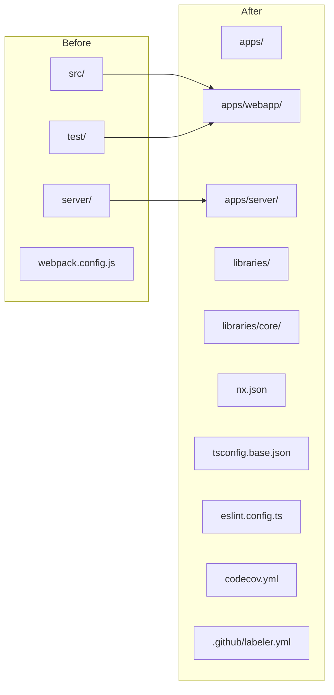
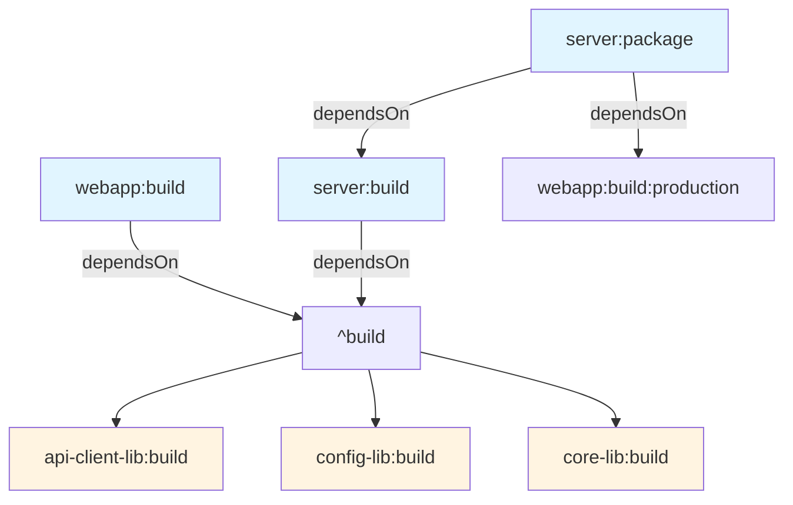
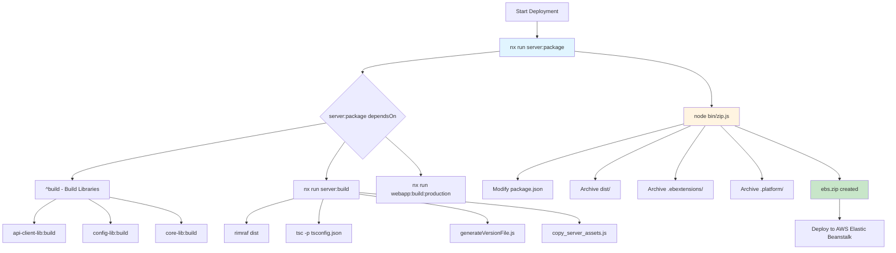

# Nx Monorepo Integration - Comprehensive Overview

## Table of Contents

- [Workspace-Tools Project](#workspace-tools-project)
- [Directory Structure Changes](#directory-structure-changes)
- [Configuration Files Overview](#configuration-files-overview)
- [Key Configuration Files Explained](#key-configuration-files-explained)
- [Adding a New App or Library](#adding-a-new-app-or-library)
- [Dependency Chain Setup](#dependency-chain-setup)
- [Visualizing the Dependency Graph](#visualizing-the-dependency-graph)
- [AWS Deployment Process](#aws-deployment-process)
- [ESLint Configuration](#eslint-configuration)
- [Why Use Nx Commands Throughout All Workflows](#why-use-nx-commands-throughout-all-workflows)
- [Nx Cache Configuration & Considerations](#nx-cache-configuration--considerations)
- [CI/CD Integration](#cicd-integration)
- [Local Development - Watching Libraries](#local-development---watching-libraries)
- [Quick Reference Commands](#quick-reference-commands)
- [Key Takeaways for Developers](#key-takeaways-for-developers)

---

## Workspace-Tools Project

The `workspace-tools` project is a special Nx project that provides workspace-level utilities. It doesn't have actual code to test or build - it's a container for shared scripts and commands.

**Available workspace-tools commands:**
- `nx run workspace-tools:clean-jest` - Clean Jest cache
- `nx run workspace-tools:changelog-production` - Generate production changelog
- `nx run workspace-tools:changelog-staging` - Generate staging changelog
- `nx run workspace-tools:changelog-rc` - Generate RC changelog
- `nx run workspace-tools:docker` - Build Docker image
- `nx run workspace-tools:release-staging` - Release to staging
- `nx run workspace-tools:release-production` - Release to production
- `nx run workspace-tools:release-custom` - Custom release

These commands are exposed as root npm scripts in [`package.json`](package.json):

```json
{
  "scripts": {
    "clean:jest": "nx reset && nx run workspace-tools:clean-jest",
    "changelog:production": "nx run workspace-tools:changelog-production",
    "changelog:staging": "nx run workspace-tools:changelog-staging",
    "changelog:rc": "nx run workspace-tools:changelog-rc",
    "deploy": "nx run server:package && eb deploy",
    "docker": "nx run workspace-tools:docker",
    "release:staging": "nx run workspace-tools:release-staging",
    "release:production": "nx run workspace-tools:release-production",
    "release:custom": "nx run workspace-tools:release-custom",
    "start": "nx serve server",
    "build:prod": "nx build webapp --configuration=production"
  }
}
```

---

## Directory Structure Changes

### Before vs After Migration



### Current Structure

```
wire-webapp/
├── apps/
│   ├── server/          # Node.js Express backend
│   └── webapp/          # React frontend
├── libraries/
│   ├── core/            # Shared core library
│   ├── api-client/      # Wire API client library
│   └── config/          # Configuration utilities library
├── .github/workflows/   # CI/CD workflows
├── .github/labeler.yml  # PR labeler configuration
├── bin/                 # Build scripts
├── charts/              # Helm charts
├── docs/                # Documentation (incl. ADRs)
├── nx.json              # Nx workspace configuration
├── package.json         # Root package.json (workspaces)
├── tsconfig.base.json   # Base TypeScript config
├── tsconfig.json        # Project references
├── tsconfig.eslint.json # ESLint TypeScript config
├── eslint.config.ts     # ESLint 9+ flat config
├── jest.preset.js       # Shared Jest preset
├── codecov.yml          # Codecov configuration
├── Jenkinsfile          # Jenkins deployment pipeline
└── .nx/                # Nx cache & workspace data
    ├── cache/            # Local cache storage
    └── workspace-data/   # Project graph data
```

---

## Configuration Files Overview

### Core Nx Configuration Files

| File | Purpose | Relevance to Monorepo |
|------|---------|----------------------|
| [`nx.json`](nx.json) | Nx workspace config, caching, target defaults | ⭐⭐⭐ Critical |
| [`tsconfig.base.json`](tsconfig.base.json) | Workspace-wide TypeScript config | ⭐⭐⭐ Critical |
| [`tsconfig.json`](tsconfig.json) | Project references | ⭐⭐⭐ Critical |
| [`tsconfig.eslint.json`](tsconfig.eslint.json) | TypeScript config for type-aware linting | ⭐⭐⭐ Critical |
| [`jest.preset.js`](jest.preset.js) | Shared Jest configuration | ⭐⭐⭐ Critical |
| [`eslint.config.ts`](eslint.config.ts) | ESLint 9+ flat config | ⭐⭐⭐ Critical |
| [`package.json`](package.json) | Root package with workspaces | ⭐⭐⭐ Critical |
| [`codecov.yml`](codecov.yml) | Codecov coverage configuration | ⭐⭐⭐ Critical |
| [`.github/labeler.yml`](.github/labeler.yml) | PR auto-labeling | ⭐⭐ High |

### Project-Specific Files

| File | Purpose |
|------|---------|
| [`apps/webapp/project.json`](apps/webapp/project.json) | Webapp Nx targets |
| [`apps/server/project.json`](apps/server/project.json) | Server Nx targets |
| [`libraries/core/project.json`](libraries/core/project.json) | Core library Nx targets |
| [`libraries/core/package.json`](libraries/core/package.json) | Core library dependencies & type mappings |
| [`libraries/api-client/project.json`](libraries/api-client/project.json) | API client library Nx targets |
| [`libraries/api-client/package.json`](libraries/api-client/package.json) | API client library dependencies |
| [`libraries/config/project.json`](libraries/config/project.json) | Config library Nx targets |
| [`libraries/config/package.json`](libraries/config/package.json) | Config library dependencies |

---

## Key Configuration Files Explained

### [`nx.json`](nx.json) - Core Nx Configuration

```json
{
  "targetDefaults": {
    "build": {
      "dependsOn": ["^build"],  // Build all upstream dependencies first
      "cache": true,
      "inputs": ["production"],  // Skip test-only files
      "outputs": ["{projectRoot}/dist"]
    },
    "test": {
      "cache": true,
      "inputs": ["default", "^production", "{workspaceRoot}/jest.preset.js"]
    },
    "lint": {
      "cache": true,
      "inputs": ["default", "{workspaceRoot}/eslint.config.ts"]
    }
  },
  "namedInputs": {
    "default": ["{projectRoot}/**/*", "sharedGlobals"],
    "production": [
      "default",
      "!{projectRoot}/**/?(*.)+(spec|test).[jt]s?(x)?(.snap)",
      "!{projectRoot}/tsconfig.spec.json",
      "!{projectRoot}/jest.config.[jt]s",
      "!{projectRoot}/.eslintrc.json",
      "!{projectRoot}/src/test-setup.[jt]s",
      "!{projectRoot}/test-setup.[jt]s"
    ]
  },
  "defaultProject": "webapp"
}
```

**Key Points:**
- `dependsOn: ["^build"]` - Automatic dependency graph resolution
- `cache: true` - Nx caching enabled for build/test/lint
- `namedInputs` - Defines file sets for cache hashing

### [`tsconfig.base.json`](tsconfig.base.json) - Base TypeScript Config

```json
{
  "compilerOptions": {
    "baseUrl": ".",
    "paths": {
      "apps/*": ["apps/*"]
    }
  }
}
```

### [`tsconfig.json`](tsconfig.json) - Project References

```json
{
  "files": [],
  "references": [
    { "path": "./apps/webapp" },
    { "path": "./apps/server" }
  ]
}
```

**Note:** The root [`tsconfig.json`](tsconfig.json) only contains references to the **applications**, not the libraries. Libraries are referenced through their own [`tsconfig.json`](libraries/core/tsconfig.json) files and are included via the [`tsconfig.eslint.json`](tsconfig.eslint.json) configuration for type-aware linting.

### [`tsconfig.eslint.json`](tsconfig.eslint.json) - Type-Aware Linting

```json
{
  "extends": "./tsconfig.base.json",
  "compilerOptions": {
    "noEmit": true,
    "paths": {
      "@wireapp/core/lib/*": ["libraries/core/src/*"],
      "@wireapp/core": ["libraries/core/src/index.ts"],
      "@wireapp/api-client": ["libraries/api-client/src/APIClient.ts"]
    }
  },
  "include": [
    "apps/webapp/src/**/*",
    "apps/webapp/test/**/*",
    "apps/server/**/*.ts",
    "libraries/core/src/**/*",
    "libraries/core/jest.setup.ts",
    "libraries/api-client/src/**/*"
  ],
  "exclude": [
    "node_modules",
    "dist",
    "coverage",
    "tmp",
    "apps/server/dist",
    "apps/webapp/dist",
    "libraries/core/lib",
    "libraries/core/.tmp",
    "libraries/api-client/lib",
    "libraries/api-client/.tmp"
  ],
  "references": [
    { "path": "./apps/webapp" },
    { "path": "./apps/server" },
    { "path": "./libraries/core" },
    { "path": "./libraries/api-client" }
  ]
}
```

**Why `paths` in [`tsconfig.eslint.json`](tsconfig.eslint.json) is critical for type-aware linting:**

The ESLint TypeScript Project Service (enabled via `projectService: true` in [`eslint.config.ts`](eslint.config.ts)) needs to understand how to resolve module imports to provide accurate type checking during linting. Without these path mappings:

1. ESLint would fail to resolve imports like `import { ConnectionService } from '@wireapp/core/lib/connection'`
2. Type-aware rules would not work correctly
3. The `projectService` option in [`eslint.config.ts`](eslint.config.ts) uses this file, so paths defined here are used by TypeScript language service

**Path Mappings for Libraries:**

- `@wireapp/core`: Maps to [`libraries/core/src/index.ts`](libraries/core/src/index.ts)
- `@wireapp/core/lib/*`: Maps to [`libraries/core/src/*`](libraries/core/src/) for subpath imports
- `@wireapp/api-client`: Maps to [`libraries/api-client/src/APIClient.ts`](libraries/api-client/src/APIClient.ts)

**Note:** The `@wireapp/config` library uses standard TypeScript compilation and does not require special path mappings in [`tsconfig.eslint.json`](tsconfig.eslint.json). Its types are resolved through the standard `types` field in [`libraries/config/package.json`](libraries/config/package.json).

### [`libraries/core/package.json`](libraries/core/package.json) - Library Configuration

```json
{
  "name": "@wireapp/core",
  "main": "lib/index",
  "types": "src/index.ts",
  "typesVersions": {
    "*": {
      "lib/*": [
        "src/*"
      ]
    }
  },
  "browser": {
    "./lib/cryptography/AssetCryptography/crypto.node": "./lib/cryptography/AssetCryptography/crypto.browser.js"
  }
}
```

**Why `typesVersions` in [`libraries/core/package.json`](libraries/core/package.json) is critical for libraries:**

The `typesVersions` field is a TypeScript feature that maps type resolution paths. It tells TypeScript that when someone imports from `lib/*` (e.g., `lib/connection`), it should resolve to `src/*` (e.g., `src/connection`). This is important because:

1. **Source-based types**: The library's type definitions are in `src/index.ts` (not in `lib/`)
2. **Compiled output**: The library compiles to `lib/` directory
3. **Import resolution**: When consumers import from the package, TypeScript needs to know that `lib/*` imports should resolve to source types for accurate IntelliSense and type checking

Without `typesVersions`, consumers would get type errors or no IntelliSense when importing subpaths like `@wireapp/core/lib/connection`.

### [`codecov.yml`](codecov.yml) - Coverage Configuration

```yaml
codecov:
  require_ci_to_pass: yes

  coverage:
    precision: 2
    round: down
    range: '45...80'
    status:
      project:
        default:
          target: auto
        app_webapp:
          target: auto
          flags:
            - app_webapp
        app_server:
          target: auto
          flags:
            - app_server
        lib_core:
          target: auto
          flags:
            - lib_core
        lib_api_client:
          target: auto
          flags:
            - lib_api_client

  flags:
    app_webapp:
      paths:
        - 'apps/webapp/**'
      carryforward: false
    app_server:
      paths:
        - 'apps/server/**'
      carryforward: true
    lib_core:
      paths:
        - 'libraries/core/**'
      carryforward: true
    lib_api_client:
      paths:
        - 'libraries/api-client/**'
      carryforward: true

  github_checks:
    annotations: false
```

**Note:** The `lib_config` library does not have a separate Codecov flag as it is a smaller utility library. Its coverage is tracked through the default project coverage.

### [`.github/labeler.yml`](.github/labeler.yml) - PR Auto-Labeling

```yaml
# Types
'type: refactoring 🛠':
  title: '^refactor(\(.+\))?:.*'
'type: bug / fix 🐞':
  title: '^(run)?fix(\(.+\))?:.*'
'type: chore 🧹':
  title: '^chore(\(.+\))?:.*'

# Apps
'app: webapp':
  files:
    - 'apps/webapp/.*'
'app: server':
  files:
    - 'apps/server/.*'

# Components
'comp: calling':
  files:
    - 'apps/webapp/src/script/repositories/calling/.*'
'comp: preferences':
  files:
    - 'apps/webapp/src/script/repositories/properties/.*'
'comp: infrastructure':
  files:
    - '.elasticbeanstalk'
    - '.github/.*'
```

---

## Adding a New App or Library

### Files to Modify/Add

#### For a New Application (e.g., `apps/new-app`)

| File | Action | Description |
|------|--------|-------------|
| [`apps/new-app/project.json`](apps/new-app/project.json) | **Create** | Nx project configuration |
| [`apps/new-app/package.json`](apps/new-app/package.json) | **Create** | App-specific dependencies |
| [`apps/new-app/tsconfig.json`](apps/new-app/tsconfig.json) | **Create** | TypeScript config |
| [`tsconfig.json`](tsconfig.json) | **Modify** | Add project reference |
| [`tsconfig.eslint.json`](tsconfig.eslint.json) | **Modify** | Add to include array |
| [`codecov.yml`](codecov.yml) | **Modify** | Add new flag for coverage |
| [`.github/labeler.yml`](.github/labeler.yml) | **Modify** | Add app label rule |

#### For a New Library (e.g., `libraries/new-lib`)

| File | Action | Description |
|------|--------|-------------|
| [`libraries/new-lib/project.json`](libraries/new-lib/project.json) | **Create** | Nx project configuration |
| [`libraries/new-lib/package.json`](libraries/new-lib/package.json) | **Create** | Library dependencies |
| [`libraries/new-lib/tsconfig.json`](libraries/new-lib/tsconfig.json) | **Create** | TypeScript config |
| [`tsconfig.json`](tsconfig.json) | **Modify** | Add project reference |
| [`tsconfig.eslint.json`](tsconfig.eslint.json) | **Modify** | Add to include array & paths |
| [`tsconfig.base.json`](tsconfig.base.json) | **Modify** | Add path mapping (optional) |
| [`codecov.yml`](codecov.yml) | **Modify** | Add new flag for coverage |
| [`.github/labeler.yml`](.github/labeler.yml) | **Modify** | Add library label rule |

### Example: New Library `libraries/ui-kit`

**Step 1: Create [`libraries/ui-kit/package.json`](libraries/ui-kit/package.json)**

```json
{
  "name": "@wireapp/ui-kit",
  "main": "lib/index",
  "types": "src/index.ts",
  "typesVersions": {
    "*": {
      "lib/*": [
        "src/*"
      ]
    }
  },
  "files": [
    "lib",
    "src"
  ]
}
```

**Step 2: Create [`libraries/ui-kit/project.json`](libraries/ui-kit/project.json)**

```json
{
  "name": "ui-kit",
  "$schema": "../../node_modules/nx/schemas/project-schema.json",
  "sourceRoot": "{projectRoot}/src",
  "projectType": "library",
  "targets": {
    "build": {
      "executor": "nx:run-commands",
      "outputs": ["{projectRoot}/lib"],
      "options": {
        "command": "tsc",
        "cwd": "{projectRoot}"
      }
    },
    "test": {
      "executor": "@nx/jest:jest",
      "outputs": ["{workspaceRoot}/coverage/libraries/ui-kit"],
      "options": {
        "jestConfig": "{projectRoot}/jest.config.js",
        "passWithNoTests": false
      }
    },
    "lint": {
      "executor": "nx:run-commands",
      "options": {
        "command": "eslint --quiet --ext .js,.ts {projectRoot}"
      }
    }
  },
  "tags": ["type:lib", "scope:ui"]
}
```

**Step 3: Update [`tsconfig.json`](tsconfig.json)**

```json
{
  "files": [],
  "references": [
    { "path": "./apps/webapp" },
    { "path": "./apps/server" },
    { "path": "./libraries/core" },
    { "path": "./libraries/ui-kit" }  // Add this
  ]
}
```

**Step 4: Update [`tsconfig.eslint.json`](tsconfig.eslint.json)**

```json
{
  "compilerOptions": {
    "paths": {
      "@wireapp/core/lib/*": ["libraries/core/src/*"],
      "@wireapp/core": ["libraries/core/src/index.ts"],
      "@wireapp/ui-kit": ["libraries/ui-kit/src/index.ts"],  // Add main import
      "@wireapp/ui-kit/lib/*": ["libraries/ui-kit/src/*"]  // Add subpath imports
    }
  },
  "include": [
    // ... existing includes
    "libraries/ui-kit/src/**/*"  // Add this
  ],
  "references": [
    // ... existing references
    { "path": "./libraries/ui-kit" }  // Add this
  ]
}
```

**Step 5: Update [`codecov.yml`](codecov.yml)**

```yaml
flags:
  # ... existing flags
  lib_ui_kit:
    paths:
      - 'libraries/ui-kit/**'
    carryforward: true

status:
  project:
    # ... existing projects
    lib_ui_kit:
      target: auto
      flags:
        - lib_ui_kit
```

**Step 6: Update [`.github/labeler.yml`](.github/labeler.yml)**

```yaml
# Libraries
'lib: ui-kit':
  files:
    - 'libraries/ui-kit/.*'
```

---

## Dependency Chain Setup

### Understanding `dependsOn`



### Dependency Examples

**Webapp depends on upstream libraries** (in [`apps/webapp/project.json`](apps/webapp/project.json)):

```json
{
  "build": {
    "dependsOn": ["^build"]
  }
}
```

The `^build` syntax means "build all upstream dependencies first". When building the webapp, Nx will automatically build `api-client-lib`, `config-lib`, and `core-lib` in the correct order.

**Server depends on upstream libraries and webapp** (in [`apps/server/project.json`](apps/server/project.json)):

```json
{
  "build": {
    "dependsOn": ["^build", "webapp:build"]
  }
}
```

The server build depends on:
1. `^build` - All upstream libraries (api-client, config, core)
2. `webapp:build` - The webapp must be built first so its static assets can be served

**Server package command** (in [`apps/server/project.json`](apps/server/project.json)):

```json
{
  "package": {
    "dependsOn": ["^build"],
    "options": {
      "commands": [
        "rimraf {projectRoot}/dist",
        "nx run server:build",
        "nx run webapp:build:production",
        "node bin/zip.js"
      ],
      "parallel": false
    }
  }
}
```

The `server:package` command:
1. Depends on `^build` (all upstream libraries)
2. Runs `server:build` (which includes webapp:build as a dependency)
3. Runs `webapp:build:production` explicitly for production assets
4. Creates the deployment bundle via [`bin/zip.js`](bin/zip.js)

### Workspace Dependencies

In [`apps/webapp/package.json`](apps/webapp/package.json):

```json
{
  "dependencies": {
    "@wireapp/core": "workspace:^"
  }
}
```

The `workspace:^` protocol tells Yarn to resolve to the local workspace version.

---

## Visualizing the Dependency Graph

Nx provides powerful tools to visualize and understand the dependency relationships in your monorepo.

### `nx graph` - Interactive Dependency Graph

The `nx graph` command opens an interactive web-based visualization of your entire project graph.

```bash
# Open the interactive dependency graph
nx graph
```

**What it shows:**
- All projects in the workspace (apps and libraries)
- Dependency relationships between projects
- Project tags and metadata
- Task targets and their dependencies

**Use cases:**
- Understanding the overall architecture
- Identifying circular dependencies
- Planning refactoring efforts
- Onboarding new developers

### `nx affected:graph` - Affected Projects Graph

The `nx affected:graph` command shows only the projects affected by recent changes.

```bash
# Show affected projects based on changes
nx affected:graph

# Show affected projects based on a specific base branch
nx affected:graph --base=origin/main

# Show affected projects based on a specific commit
nx affected:graph --base=HEAD~5
```

**What it shows:**
- Only projects that have been affected by changes
- The dependency chain from changed files to affected projects
- Which projects need to be rebuilt/retested

**Use cases:**
- CI/CD pipelines (only build/test what changed)
- Pull request validation
- Understanding impact of your changes

### `nx show project` - Project Details

The `nx show project` command displays detailed information about a specific project.

```bash
# Show project details in the browser
nx show project webapp

# Show project details in the CLI
nx show project webapp --web=false

# Show project details for a library
nx show project core-lib --web=false

# Show project details with JSON output
nx show project webapp --json
```

**What it shows:**
- Project name and type (app/library)
- Source root directory
- All targets (build, test, lint, etc.) with their configurations
- Dependencies (which projects this project depends on)
- Implicit dependencies (inferred from imports)
- Tags

**Example output (CLI):**

```
webapp [app]

tags: type:app, scope:frontend

targets:
  build:
    executor: nx:run-commands
    dependsOn: ^build
    outputs: {workspaceRoot}/apps/server/dist/static

  test:
    executor: @nx/jest:jest
    outputs: {workspaceRoot}/coverage/apps/webapp

dependencies:
  - api-client-lib
  - config-lib
  - core-lib

implicitDependencies:
  - server (via build output)
```

### Visualizing Task Dependencies

You can also visualize task dependencies within projects:

```bash
# View task dependencies in the graph
nx graph --focus=webapp

# View only build tasks
nx graph --focus=build

# View affected build tasks
nx affected:graph --target=build
```

### Common Patterns

```bash
# Check what depends on a specific library
nx show project core-lib --web=false | grep -A 20 "dependents"

# See the full impact of changing a library
nx affected:graph --base=HEAD~1 --focus=core-lib

# Verify dependency chain before a build
nx show project server --web=false

# Find circular dependencies
nx graph --focus=circular
```

### Tips for Effective Graph Visualization

1. **Use `--focus` to narrow down** - When working on specific areas, focus on relevant projects
2. **Check affected projects before PR** - Run `nx affected:graph` to see what your changes impact
3. **Use `--web=false` for CI** - In CI pipelines, use CLI output instead of opening a browser
4. **Combine with `--json`** - Parse output programmatically for custom scripts
5. **Use `nx graph` for planning** - Before refactoring, visualize the current structure

---

## AWS Deployment Process

The wire-webapp uses a specialized deployment process to AWS Elastic Beanstalk that bundles both the server and webapp into a self-contained deployment package. This process is different from standard deployments because it pre-bundles workspace dependencies.

### Deployment Workflow Overview



### The `server:package` Command

The deployment is triggered by running:

```bash
nx run server:package
```

This command is defined in [`apps/server/project.json`](apps/server/project.json):

```json
{
  "package": {
    "executor": "nx:run-commands",
    "dependsOn": ["^build"],
    "outputs": ["{projectRoot}/dist/s3"],
    "options": {
      "commands": [
        "rimraf {projectRoot}/dist",
        "nx run server:build",
        "nx run webapp:build:production",
        "node bin/zip.js"
      ],
      "parallel": false
    }
  }
}
```

The package command executes these steps sequentially:
1. `rimraf {projectRoot}/dist` - Clean the dist directory
2. `nx run server:build` - Build the server (which includes library builds)
3. `nx run webapp:build:production` - Build the webapp for production
4. `node bin/zip.js` - Create the deployment bundle

### Workspace Dependency Pre-Bundling

The deployment process includes a special step to pre-bundle workspace dependencies. This is handled by [`apps/server/bin/copy_server_assets.js`](apps/server/bin/copy_server_assets.js).

**Why this is needed:**

In a standard deployment, `npm install` would resolve dependencies from npm. However, our monorepo uses workspace dependencies (`workspace:^`) which are local packages. When deploying to AWS, we need to:

1. Pre-compile all workspace libraries
2. Copy the compiled output to the deployment bundle
3. Ensure the deployment package is self-contained

**How it works:**

The script reads [`apps/server/package.json`](apps/server/package.json) to find workspace dependencies:

```javascript
const serverPackageJson = require('../package.json');
const workspaceDeps = Object.entries(serverPackageJson.dependencies || {})
  .filter(([, version]) => version.startsWith('workspace:'))
  .map(([name]) => name);

console.log('Bundling workspace dependencies:', workspaceDeps.join(', '));
```

For each workspace dependency, it:
1. Locates the library in the monorepo (`libraries/{lib-name}`)
2. Copies the compiled `lib/` directory to `dist/node_modules/@wireapp/{lib-name}/lib/`
3. Copies the `package.json` to `dist/node_modules/@wireapp/{lib-name}/package.json`

This creates a self-contained deployment where all workspace dependencies are pre-bundled and ready to run.

### Version Resolution for Workspace Dependencies

The [`bin/zip.js`](bin/zip.js) script handles version resolution for workspace dependencies:

```javascript
// Read and modify package.json to handle workspace dependencies
const packageJson = JSON.parse(fs.readFileSync(path.join(SERVER_PATH, 'package.json'), 'utf8'));

// Convert workspace:* dependencies to "*" version - they're pre-bundled in node_modules
const workspaceDeps = [];
if (packageJson.dependencies) {
  Object.keys(packageJson.dependencies).forEach(dep => {
    if (packageJson.dependencies[dep].startsWith('workspace:')) {
      console.log(`Marking workspace dependency as pre-bundled: ${dep}`);
      workspaceDeps.push(dep);
      // Read version from the library's package.json
      const libPkgPath = path.join(ROOT_PATH, 'libraries', dep.replace('@wireapp/', ''), 'package.json');
      if (fs.existsSync(libPkgPath)) {
        const libPkg = JSON.parse(fs.readFileSync(libPkgPath, 'utf8'));
        packageJson.dependencies[dep] = libPkg.version;
      } else {
        packageJson.dependencies[dep] = '*';
      }
    }
  });
}
```

This ensures that:
1. The deployment package's `package.json` has concrete versions instead of `workspace:*`
2. AWS Elastic Beanstalk doesn't try to resolve workspace dependencies
3. The pre-bundled libraries in `node_modules` are used directly

### Deployment Bundle Structure

The [`bin/zip.js`](bin/zip.js) script creates the `ebs.zip` file with the following structure:

```
ebs.zip
├── package.json              # Modified with resolved versions
├── .env.defaults             # Environment defaults
├── Procfile                  # AWS Elastic Beanstalk process config
├── .ebextensions/            # AWS Elastic Beanstalk extensions
│   └── *.config              # Deployment configuration
├── .platform/                # Platform hooks
│   └── hooks/                # Pre/Post build hooks
├── dist/                     # Server compiled output
│   ├── index.js              # Main server entry point
│   ├── routes/               # Server routes
│   ├── static/               # Webapp static assets (from webapp:build)
│   │   └── *.js, *.css, etc.
│   ├── robots/               # Robot.txt files
│   ├── templates/            # HTML templates
│   ├── certificate/          # SSL certificates (dev)
│   └── node_modules/         # Pre-bundled workspace dependencies
│       └── @wireapp/
│           ├── core/lib/     # Pre-compiled core library
│           ├── api-client/lib/ # Pre-compiled api-client library
│           └── config/lib/   # Pre-compiled config library
```

### Dual Build Chain

The deployment process uses a dual build chain:

1. **Server Build Chain:**
   - `server:build` depends on `^build` (all libraries)
   - Compiles server TypeScript to JavaScript
   - Generates version file
   - Copies server assets and pre-bundles workspace libraries

2. **Webapp Build Chain:**
   - `webapp:build:production` depends on `^build` (all libraries)
   - Builds React webapp with webpack
   - Outputs to `apps/server/dist/static/` (served by server)

Both build chains share the same library dependencies, ensuring consistency.

### Special Considerations

**Workspace Dependency Ordering:**

Nx automatically handles the build order for libraries based on their dependency graph. The `^build` dependency ensures that:
- `core-lib` builds first (no library dependencies)
- `config-lib` builds second (may depend on core)
- `api-client-lib` builds third (may depend on core and config)

**Production vs Development:**

The deployment always uses `webapp:build:production` to ensure optimized assets are deployed. Development builds are not included in the deployment bundle.

**Environment Configuration:**

The deployment includes:
- `.env.defaults` - Default environment variables
- Environment-specific config loaded at runtime
- No secrets in the deployment bundle (loaded from AWS Elastic Beanstalk environment)

**Deployment Artifacts:**

The final `ebs.zip` file is uploaded to AWS Elastic Beanstalk via the `eb deploy` command (defined in [`package.json`](package.json) as `deploy` script).

### Edge Cases and Troubleshooting

**Missing Library Build:**

If you see errors about missing library files during deployment:
1. Ensure all libraries have been built: `nx run-many -t build --all`
2. Check that `lib/` directories exist in each library
3. Verify the library's `project.json` has a `build` target

**Version Mismatches:**

If deployment fails due to version issues:
1. Check that [`libraries/{lib}/package.json`](libraries/core/package.json) has correct versions
2. Verify [`apps/server/package.json`](apps/server/package.json) uses `workspace:^` for workspace deps
3. Run `yarn install` to update local workspace resolution

**Asset Copy Failures:**

If static assets are missing:
1. Verify `webapp:build:production` outputs to `apps/server/dist/static/`
2. Check the webpack output configuration in [`apps/webapp/webpack.config.js`](apps/webapp/webpack.config.js)
3. Ensure the build completes successfully before packaging

**Deployment Bundle Size:**

The deployment bundle includes all pre-bundled libraries, which can be large. To optimize:
1. Ensure only necessary dependencies are included
2. Use production builds for all libraries
3. Consider tree-shaking in library builds if applicable

---

## ESLint Configuration

This project uses ESLint 9+ with the new flat config format. The configuration is centralized in [`eslint.config.ts`](eslint.config.ts) and provides type-aware linting across the entire monorepo.

### Single Config File Approach

Unlike traditional ESLint setups that use multiple `.eslintrc.*` files, this project uses a single [`eslint.config.ts`](eslint.config.ts) file with the flat config format introduced in ESLint 9.

**Benefits of flat config:**
- Better TypeScript support (config is written in TypeScript)
- More predictable configuration merging
- Easier to maintain and debug
- No need for multiple config files across the project

### Config Structure

The ESLint configuration is structured into multiple config objects:

```typescript
const config: Linter.Config[] = [
  {ignores},                    // 1. Ignore patterns
  ...cleanedBase,               // 2. Base config from @wireapp/eslint-config
  {rules: {...}},               // 3. Adjust legacy bits from extended config
  {                             // 4. TypeScript/React config
    files: ['**/*.{ts,tsx}'],
    languageOptions: {...},
    plugins: {...},
    rules: {...}
  },
  {                             // 5. JavaScript config
    files: ['**/*.js', '**/*.jsx', '**/*.cjs', '**/*.mjs'],
    languageOptions: {...},
    rules: {...}
  },
  {                             // 6. Test config
    files: ['**/*.test.tsx', '**/*.test.ts', '**/*.spec.tsx', '**/*.spec.ts'],
    rules: {...}
  }
];
```

### 1. Ignore Patterns

The first config object defines files and directories to ignore:

```typescript
const ignores = [
  '.git/',
  'docs/',
  'bin/',
  '**/node_modules/',
  'apps/webapp/assets/',
  'resource/',
  'apps/webapp/resource/',
  'apps/webapp/test/',
  '**/__mocks__/**',
  '**/setupTests.*',
  '**/*.config.*',
  'apps/webapp/*.config.*',
  'apps/webapp/src/sw.js',
  'apps/server/bin/',
  'apps/server/dist/',
  'apps/server/node_modules/',
  'apps/webapp/src/ext/',
  'apps/webapp/src/script/localization/**/webapp*.js',
  'apps/webapp/src/worker/',
  'apps/webapp/src/script/components/Icon.tsx',
  '**/*.test.*',
  '**/*.spec.*',
  '*.js',
  'apps/webapp/src/types/i18n.d.ts',
  'apps/webapp/playwright-report/',
  'libraries/core/lib/',
  'libraries/api-client/lib/',
  'libraries/api-client/demo.ts',
  'libraries/core/.tmp/',
  'libraries/core/src/demo/',
  'libraries/core/src/test/',
  'libraries/config/lib/',
  '**/jest.setup.ts',
];
```

### 2. Base Config from @wireapp/eslint-config

The configuration extends [`@wireapp/eslint-config`](eslint.config.ts) using the `FlatCompat` utility:

```typescript
const compat = new FlatCompat({
  baseDirectory: __dirname,
  resolvePluginsRelativeTo: __dirname,
});

const base = compat.extends('@wireapp/eslint-config');
```

**Important:** The base config is cleaned to remove the `project` option from parser options to avoid conflicts with `projectService`:

```typescript
const cleanedBase = base.map(cfg => {
  if (cfg.languageOptions?.parserOptions) {
    const parserOptions = cfg.languageOptions.parserOptions as Record<string, unknown>;
    const {project, ...rest} = parserOptions;
    return {
      ...cfg,
      languageOptions: {
        ...cfg.languageOptions,
        parserOptions: rest,
      },
    };
  }
  return cfg;
});
```

### 3. Legacy Config Adjustments

Some rules from the extended config are adjusted for compatibility:

```typescript
{
  rules: {
    'no-unsanitized/DOM': 'off', // deprecated config variant
    'valid-jsdoc': 'off', // rule removed in ESLint 9
    'header/header': 'off', // disable existing header rule to use our own
  },
}
```

### 4. TypeScript/React Config

The main configuration for TypeScript and React files:

```typescript
{
  files: ['**/*.{ts,tsx}'],
  languageOptions: {
    parser: tsParser,
    parserOptions: {
      // Enable type-aware linting for TypeScript sources with project references support
      projectService: true,
      tsconfigRootDir: __dirname,
    },
    globals: {
      ...globals.browser,
      ...globals.node,
      React: 'readonly',
      JSX: 'readonly',
      amplify: 'readonly',
      NodeJS: 'readonly',
    },
  },
  plugins: {
    '@emotion': emotionPlugin,
    import: importPlugin,
    'react-hooks': reactHooksPlugin,
    'header-tony': headerPlugin,
  },
  rules: {
    // ... rules
  },
  settings: {
    'import/resolver': {
      typescript: {
        alwaysTryTypes: true,
      },
      node: {
        extensions: ['.js', '.jsx', '.ts', '.tsx'],
      },
    },
  },
}
```

### Type-Aware Linting with projectService

The key feature enabling type-aware linting is `projectService: true`:

```typescript
parserOptions: {
  projectService: true,
  tsconfigRootDir: __dirname,
}
```

**How it works:**

1. **Automatic Project Discovery:** ESLint automatically discovers all TypeScript projects in the workspace using [`tsconfig.json`](tsconfig.json) references
2. **TypeScript Language Service:** Uses the TypeScript language service for accurate type information
3. **Multi-Project Support:** Handles multiple projects (apps and libraries) seamlessly
4. **Path Mapping Resolution:** Uses [`tsconfig.eslint.json`](tsconfig.eslint.json) for path mappings

**Why `projectService` instead of `project`:**

- `projectService` automatically discovers projects from `tsconfig.json` references
- No need to manually specify which `tsconfig.json` to use
- Better support for monorepos with multiple projects
- Handles project references automatically

### Path Mappings and Import Resolution

The `import/resolver` settings configure how imports are resolved:

```typescript
settings: {
  'import/resolver': {
    typescript: {
      alwaysTryTypes: true,
    },
    node: {
      extensions: ['.js', '.jsx', '.ts', '.tsx'],
    },
  },
}
```

This enables:
- TypeScript path mapping resolution (e.g., `@wireapp/core/lib/connection`)
- Node module resolution
- Type-aware import checking

### 5. JavaScript Config

JavaScript files have a separate configuration:

```typescript
{
  files: ['**/*.js', '**/*.jsx', '**/*.cjs', '**/*.mjs'],
  languageOptions: {
    parser: require('espree'),
    parserOptions: {
      project: null,
      tsconfigRootDir: __dirname,
    },
  },
  rules: {
    // Disable TS-only rules on JS mocks/shims
    '@typescript-eslint/require-array-sort-compare': 'off',
    '@typescript-eslint/no-unused-vars': 'off',
  },
}
```

### 6. Test Config

Test files have relaxed rules:

```typescript
{
  files: ['**/*.test.tsx', '**/*.test.ts', '**/*.spec.tsx', '**/*.spec.ts', '**/test/**/*', '**/mocks/**/*'],
  rules: {
    'no-magic-numbers': 'off',
    'id-length': 'off',
  },
}
```

### Copyright Headers

The configuration enforces copyright headers using the `@tony.ganchev/eslint-plugin-header` plugin:

```typescript
'header-tony/header': [
  'error',
  'block',
  [
    '',
    ' * Wire',
    {
      pattern: ' \\* Copyright \\(C\\) \\d{4} Wire Swiss GmbH',
      template: ` * Copyright (C) ${year} Wire Swiss GmbH`,
    },
    ' *',
    ' * This program is free software: you can redistribute it and/or modify',
    // ... rest of GPL header
  ],
  2,
],
```

This ensures all source files have the proper GPL copyright header with the current year.

### Custom Plugins

The configuration uses several custom plugins:

- `@emotion/eslint-plugin` - Enforces Emotion CSS-in-JS best practices
- `eslint-plugin-import` - Import/export linting
- `eslint-plugin-react-hooks` - React Hooks rules
- `@tony.ganchev/eslint-plugin-header` - Copyright header enforcement

### Rule Customizations

Several rules are customized for the project:

```typescript
rules: {
  '@emotion/pkg-renaming': 'error',
  '@emotion/no-vanilla': 'error',
  '@emotion/import-from-emotion': 'error',
  '@emotion/styled-import': 'error',
  'id-length': 'warn',
  '@typescript-eslint/explicit-module-boundary-types': 'off',
  '@typescript-eslint/ban-ts-comment': 'off',
  '@typescript-eslint/no-var-requires': 'off',
  '@typescript-eslint/no-non-null-assertion': 'off',
  '@typescript-eslint/no-floating-promises': 'warn',
  '@typescript-eslint/no-unused-vars': [
    'warn',
    {
      argsIgnorePattern: '^(_?err(or)?|error)$',
      varsIgnorePattern: '^(_?err(or)?|error)$',
    },
  ],
  'no-dupe-class-members': 'off',
  'no-unsanitized/property': 'off',
  'prefer-promise-reject-errors': 'off',
  'jest/no-jasmine-globals': 'off',
  'jsx-a11y/media-has-caption': 'off',
  'no-empty': 'error',
}
```

### Running ESLint

```bash
# Lint a specific project
nx lint webapp
nx lint server
nx lint core-lib

# Lint all projects
nx run-many -t lint --all

# Lint affected projects
nx affected -t lint

# Lint with auto-fix
nx lint webapp --fix
```

### Common Issues

**Type-aware linting not working:**

1. Ensure [`tsconfig.eslint.json`](tsconfig.eslint.json) is properly configured
2. Check that path mappings are correct for library imports
3. Verify that `projectService: true` is set in [`eslint.config.ts`](eslint.config.ts)
4. Run `tsc --build` to ensure all projects are compiled

**Import resolution errors:**

1. Check path mappings in [`tsconfig.eslint.json`](tsconfig.eslint.json)
2. Verify `import/resolver` settings in [`eslint.config.ts`](eslint.config.ts)
3. Ensure `alwaysTryTypes: true` is set for TypeScript resolver

**Performance issues:**

1. ESLint with type-aware linting can be slower
2. Use `nx affected -t lint` to only lint changed files
3. Consider running type-check separately: `nx type-check <project>`

---

## Why Use Nx Commands Throughout All Workflows

Using Nx commands consistently across all workflows (local development, CI/CD, testing, building) is critical for maintaining a healthy monorepo. This section explains why you should always use Nx commands instead of running underlying tools directly.

### 1. Dependency Graph Resolution

Nx automatically builds dependencies in the correct order based on the project graph defined in [`nx.json`](nx.json) and each project's [`project.json`](apps/webapp/project.json).

**What happens when you use Nx commands:**

```bash
nx build webapp
```

Nx will:
1. Read the project graph
2. Identify that `webapp` depends on `api-client-lib`, `config-lib`, and `core-lib`
3. Build libraries in the correct order (based on their own dependencies)
4. Only then build the webapp

**What happens when you run webpack directly:**

```bash
cd apps/webapp && yarn build
```

You might get:
- Missing library build errors (libraries haven't been built)
- Outdated library code (using old `lib/` output)
- Inconsistent state between local and CI

### 2. Caching

Nx cache saves time by reusing previous build results. When you use Nx commands, the cache is automatically managed.

**Cache benefits:**
- **Faster builds:** Nx only rebuilds what changed
- **Consistent results:** Same inputs = same outputs (deterministic)
- **Cross-machine sharing:** Cache can be shared across team members (with Nx Cloud)

**Example:**

```bash
# First run - builds everything
nx build webapp

# Second run (no changes) - uses cache
nx build webapp
# [nx] Cache miss for build-12345...
# [nx] SUCCESS  Cached output used for build-12345

# After changing one file in core-lib
nx build webapp
# [nx] Cache hit for api-client-lib:build
# [nx] Cache hit for config-lib:build
# [nx] Cache miss for core-lib:build (rebuilding...)
# [nx] Cache miss for webapp:build (rebuilding...)
```

**When you run tools directly:**
- No caching benefits
- Every build is a full rebuild
- Slower development feedback loop

### 3. Affected Detection

Nx can detect which projects are affected by changes, allowing you to only build/test what changed.

**Affected detection in action:**

```bash
# Only build projects affected by current changes
nx affected -t build

# Only test projects affected by current changes
nx affected -t test

# Only lint projects affected by current changes
nx affected -t lint
```

**How it works:**
1. Nx analyzes the git diff between current branch and base branch
2. Maps changed files to projects
3. Uses the dependency graph to find affected projects
4. Only runs commands on affected projects

**When you run tools directly:**
- No way to know which projects are affected
- Must build/test everything
- Wastes time on unrelated projects

### 4. Consistency Across Environments

Using Nx commands ensures consistent behavior between local development and CI/CD.

**Local development:**

```bash
nx run-many -t build test lint --all
```

**CI/CD pipeline (GitHub Actions):**

```yaml
- name: Build and test
  run: nx run-many -t build test lint --all
```

Both environments:
- Use the same dependency resolution
- Use the same caching mechanism
- Use the same build/test configurations
- Produce consistent results

**When you run tools directly:**
- Local behavior might differ from CI
- Hard to reproduce CI issues locally
- "Works on my machine" problems

### 5. Project Graph Awareness

Nx understands the entire monorepo structure and uses this knowledge to optimize operations.

**Project graph benefits:**
- **Smart scheduling:** Nx can run independent tasks in parallel
- **Optimized ordering:** Dependencies are built in optimal order
- **Impact analysis:** Understand how changes propagate through the codebase

**Example:**

```bash
# Nx knows these can run in parallel
nx run-many -t test --parallel

# Nx knows these must run in order
nx build server
```

### 6. Performance with Nx Daemon

Nx runs a daemon process that maintains the project graph in memory for faster operations.

**Daemon benefits:**
- **Instant project graph loading:** No need to re-analyze files
- **Fast dependency resolution:** Graph is already in memory
- **Watch mode efficiency:** Instant updates when files change

**Daemon location:** `.nx/workspace-data/`

**When you run tools directly:**
- No daemon benefits
- Slower startup times
- Repeated file analysis

### 7. Avoiding Direct Tool Usage

Running underlying tools directly (webpack, jest, tsc, eslint) can cause several issues:

| Issue | Running with Nx | Running Directly |
|--------|----------------|-----------------|
| **Dependency order** | Automatic | Manual, error-prone |
| **Caching** | Automatic | None |
| **Affected detection** | Available | Not available |
| **Parallel execution** | Optimized | Manual |
| **CI consistency** | Guaranteed | Not guaranteed |
| **Project graph** | Aware | Unaware |
| **Performance** | Optimized | Slower |

### Common Pitfalls

**Running `yarn build` directly:**

```bash
# DON'T DO THIS
cd apps/webapp && yarn build

# INSTEAD DO THIS
nx build webapp
```

**Running `yarn test` directly:**

```bash
# DON'T DO THIS
cd apps/webapp && yarn test

# INSTEAD DO THIS
nx test webapp
```

**Running `tsc` directly:**

```bash
# DON'T DO THIS
tsc --project apps/webapp/tsconfig.json

# INSTEAD DO THIS
nx type-check webapp
```

### Best Practices

1. **Always use Nx commands** - For build, test, lint, and any other task
2. **Use `nx run-many`** - When you need to run tasks on multiple projects
3. **Use `nx affected`** - When you only want to work with changed projects
4. **Check `nx graph`** - To understand the project structure
5. **Use `nx show project`** - To see project details and dependencies
6. **Configure targets in `project.json`** - Don't create custom scripts that bypass Nx
7. **Use Nx cache** - Let Nx handle caching for you

### Example Workflow

**Correct workflow:**

```bash
# 1. Make changes to code

# 2. See what's affected
nx affected:graph

# 3. Build affected projects
nx affected -t build

# 4. Test affected projects
nx affected -t test

# 5. Lint affected projects
nx affected -t lint

# 6. If everything passes, commit and push
```

**Incorrect workflow:**

```bash
# 1. Make changes to code

# 2. Build everything manually
cd apps/webapp && yarn build
cd apps/server && yarn build

# 3. Test everything manually
cd apps/webapp && yarn test
cd apps/server && yarn test

# 4. Lint everything manually
cd apps/webapp && yarn lint
cd apps/server && yarn lint
```

The incorrect workflow:
- Takes longer (no caching, no affected detection)
- May miss dependencies (manual order)
- May behave differently in CI
- Is harder to maintain

---

## Nx Cache Configuration & Considerations

### Cache Configuration in [`nx.json`](nx.json)

```json
{
  "targetDefaults": {
    "build": {
      "cache": true,
      "outputs": ["{projectRoot}/dist"]
    },
    "test": {
      "cache": true,
      "outputs": ["{workspaceRoot}/coverage/apps/webapp"]
    },
    "lint": {
      "cache": true
    }
  }
}
```

### Cache Key Inputs

```json
{
  "namedInputs": {
    "default": ["{projectRoot}/**/*", "sharedGlobals"],
    "production": [
      "default",
      "!{projectRoot}/**/?(*.)+(spec|test).[jt]s?(x)?(.snap)",
      "!{projectRoot}/tsconfig.spec.json",
      "!{projectRoot}/jest.config.[jt]s",
      "!{projectRoot}/.eslintrc.json",
      "!{projectRoot}/src/test-setup.[jt]s",
      "!{projectRoot}/test-setup.[jt]s"
    ]
  }
}
```

### Important Cache Considerations

| Consideration | Details |
|---------------|---------|
| **Cache Location** | Local: `.nx/cache`, Remote: Nx Cloud (optional) |
| **Cache Invalidation** | Automatic based on file hashes |
| **Shared Files** | Add to `sharedGlobals` in [`nx.json`](nx.json) if they affect all projects |
| **Environment Variables** | Not included in cache by default - use `env` in inputs if needed |
| **CI Cache** | Use `nx reset` before CI runs to ensure clean state |
| **Cache Persistence** | Cache persists across sessions - use `nx reset` to clear |

### Cache Commands

```bash
# Reset cache (clears all cached artifacts)
nx reset

# Skip cache for a specific command
nx build webapp --skip-nx-cache

# View cache hits/misses
nx build webapp --verbose

# List cached tasks
nx show project webapp
```

### CI/CD Cache Integration

**GitHub Actions** ([`.github/workflows/ci.yml`](.github/workflows/ci.yml)):

```yaml
- name: Setup Node.js
  uses: actions/setup-node@v6
  with:
    node-version-file: '.nvmrc'
    cache: 'yarn'  # Yarn cache for node_modules
```

**Note**: Nx cache is local by default. For CI cache persistence, consider:
1. Nx Cloud for distributed caching
2. GitHub Actions cache for `.nx/cache` directory
3. Self-hosted cache storage

---

## CI/CD Integration

### GitHub Workflows Using Nx

| Workflow | Nx Commands Used |
|----------|------------------|
| [`ci.yml`](.github/workflows/ci.yml) | `nx run-many -t lint --all`, `nx run-many -t test --all` |
| [`precommit.yml`](.github/workflows/precommit.yml) | `nx run webapp:configure`, `nx run server:package` |
| [`publish.yml`](.github/workflows/publish.yml) | `nx run webapp:configure`, `nx run-many -t test --all`, `nx run server:package` |

### Codecov Upload in CI

From [`.github/workflows/ci.yml`](.github/workflows/ci.yml):

```yaml
- name: Upload webapp coverage to Codecov
  uses: codecov/codecov-action@v5.5.2
  with:
    fail_ci_if_error: false
    files: ./apps/webapp/coverage/lcov.info
    flags: app_webapp
    token: ${{ secrets.CODECOV_TOKEN }}

- name: Upload server coverage to Codecov
  uses: codecov/codecov-action@v5.5.2
  with:
    fail_ci_if_error: false
    files: ./apps/server/coverage/lcov.info
    flags: app_server
    token: ${{ secrets.CODECOV_TOKEN }}

- name: Upload core library coverage to Codecov
  uses: codecov/codecov-action@v5.5.2
  with:
    fail_ci_if_error: false
    files: ./coverage/libraries/core/lcov.info
    flags: lib_core
    token: ${{ secrets.CODECOV_TOKEN }}
```

### Common Nx CI Patterns

```bash
# Run all tests
nx run-many -t test --all --configuration=ci

# Run all linting
nx run-many -t lint --all

# Run affected projects only
nx affected -t build test lint

# Build specific configuration
nx build webapp --configuration=production
```

### Jenkins Integration

The [`Jenkinsfile`](Jenkinsfile) waits for GitHub Actions to complete:

```groovy
stage('Wait for GitHub action to finish') {
  when {
    expression { BRANCH_NAME ==~ /PR-[0-9]+/ }
  }
  steps {
    // Waits for GitHub workflow completion
  }
}
```

---

## Local Development - Watching Libraries

### Nx Watch Mode

Nx automatically watches all projects in the workspace. When you add a new library, Nx will automatically detect it and include it in the dependency graph.

```bash
# Start dev server with watch mode
nx serve webapp --watch

# Start multiple dev servers
nx run-many -t serve --parallel --watch
```

### TypeScript Path Mappings for Import Resolution

In [`tsconfig.eslint.json`](tsconfig.eslint.json), path mappings enable clean imports:

```json
{
  "compilerOptions": {
    "paths": {
      "@wireapp/core/lib/*": ["libraries/core/src/*"],
      "@wireapp/core": ["libraries/core/src/index.ts"]
    }
  }
}
```

This allows imports like:
```typescript
import { ConnectionService } from '@wireapp/core/lib/connection';
import { Account } from '@wireapp/core';
```

### Workspace Dependencies in package.json

In [`apps/webapp/package.json`](apps/webapp/package.json):

```json
{
  "dependencies": {
    "@wireapp/core": "workspace:^"
  }
}
```

The `workspace:^` protocol ensures:
- Local workspace packages are linked (no symlinks needed)
- Version is automatically resolved to the local workspace version
- Changes to the library trigger rebuilds of dependent projects

### Nx Daemon for Fast Rebuilds

Nx runs a daemon process that:
- Watches file changes
- Maintains the project graph in memory
- Provides instant dependency resolution

The daemon is located at `.nx/workspace-data/` and runs automatically.

---

## Quick Reference Commands

### Common Nx Commands

```bash
# Build
nx build <project>                    # Build specific project
nx run-many -t build --all           # Build all projects
nx affected -t build                  # Build affected projects

# Test
nx test <project>                     # Test specific project
nx run-many -t test --all             # Test all projects
nx test <project> --coverage          # Test with coverage

# Lint
nx lint <project>                     # Lint specific project
nx run-many -t lint --all             # Lint all projects

# Development
nx serve <project>                    # Start dev server
nx run-many -t serve --parallel       # Start multiple dev servers

# Graph & Analysis
nx graph                              # Visualize dependency graph
nx affected:graph                     # Show affected projects
nx show project <project>             # Show project details

# Cache
nx reset                              # Clear cache
```

### Project Tags

Projects use tags for organization:

```json
{
  "tags": ["type:app", "scope:frontend"]  // apps/webapp
  "tags": ["type:app", "scope:backend"]   // apps/server
  "tags": ["type:lib", "scope:core"]      // libraries/core
}
```

Run by tags:
```bash
nx run-many -t build --projects=tag:frontend
nx run-many -t test --projects=tag:lib
```

---

## Key Takeaways for Developers

1. **Always use Nx commands** - Don't run webpack, jest, or tsc directly
2. **Understand `dependsOn`** - Dependencies are automatically built first
3. **Cache is your friend** - Nx cache saves time, but remember `nx reset` when needed
4. **Add projects to [`tsconfig.json`](tsconfig.json)** - Project references are required
5. **Update [`tsconfig.eslint.json`](tsconfig.eslint.json)** - For type-aware linting to work
6. **Use `workspace:^`** - For local workspace dependencies in package.json
7. **Update [`codecov.yml`](codecov.yml)** - Add new flags for new libraries/apps
8. **Update [`.github/labeler.yml`](.github/labeler.yml)** - Add label rules for new projects
9. **Check `nx graph`** - Visualize dependencies before making changes
10. **CI uses Nx** - All GitHub workflows use Nx commands
11. **Nx watches all projects** - No manual symlink setup needed for library watching
12. **Path mappings enable clean imports** - Use TypeScript paths for library imports
13. **`typesVersions` in libraries** - Maps `lib/*` imports to `src/*` for source-based type resolution
14. **`paths` in tsconfig.eslint.json** - Required for ESLint TypeScript Project Service to resolve imports during linting
