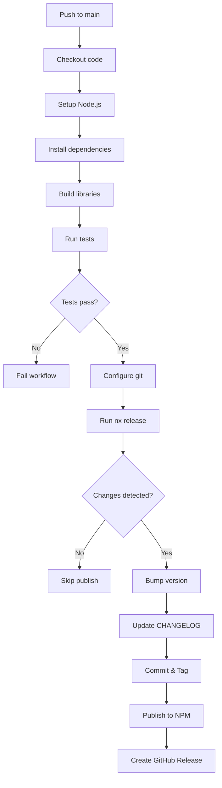

# Releasing @wireapp/logger to NPM

This document describes how to release the Logger library to NPM using Nx Release.

## Overview

The Logger library uses [Nx Release](https://nx.dev/docs/guides/nx-release/release-npm-packages) for automated versioning, changelog generation, and publishing to NPM. Releases are managed through Git tags and can be triggered manually or via CI/CD.

The library uses **independent releases**, meaning:

- Each library has its own version number and release cycle
- Changelogs only include commits that affected files in that specific library
- Git tags follow the pattern `@wireapp/logger@{version}` (e.g., `@wireapp/logger@0.1.0`)
- Only libraries with actual changes since the last release will be published

## Prerequisites

Before releasing, ensure you have:

1. **NPM Access**: You need write access to the `@wireapp` organization on NPM
2. **NPM Token**: Set up your NPM authentication token locally or in CI/CD
3. **Git Permissions**: Push access to the repository and ability to create tags
4. **Clean Working Directory**: No uncommitted changes

## Release Process

### 1. Local Release (Manual)

#### First Time Setup

For the very first release of the library, use the `--first-release` flag:

```bash
# Dry-run to preview changes
yarn release:libs:dry-run --first-release

# If everything looks good, run the actual release
yarn release:libs --first-release
```

This will:

- Prompt you to select a version (e.g., `0.1.0`)
- Update `package.json` version
- Create `CHANGELOG.md` with only Logger-specific commits
- Commit changes with message: `chore(release): publish @wireapp/logger@{version}`
- Create a git tag `@wireapp/logger@{version}`
- Publish to NPM with `@wireapp/logger@{version}`

#### Subsequent Releases

For all releases after the first one:

```bash
# Preview the release
yarn release:libs:dry-run

# Execute the release
yarn release:libs
```

Nx will:

- Analyze commits that touched `libraries/Logger/**` files since the last release
- Suggest a version bump based on [Conventional Commits](https://www.conventionalcommits.org/)
- Generate changelog from commit messages that affected the Logger library only
- Create tag and publish
- Skip release if no relevant changes detected

### 2. CI/CD Release (Automatic)

The library is automatically released when changes are pushed to the `main` branch.

#### Automatic Release on Main

When you merge a PR to `main` that includes changes to `libraries/**`:

1. GitHub Actions workflow `.github/workflows/release-libraries.yml` triggers
2. Runs tests and builds
3. Analyzes changes using Nx Release
4. Publishes new version to NPM if there are changes
5. Creates git tags and GitHub releases

#### Manual Force Publish

You can manually trigger a release from the GitHub Actions UI:

1. Go to **Actions** → **Release Libraries**
2. Click **Run workflow**
3. Select `main` branch
4. Check **force_publish** checkbox
5. Click **Run workflow**

This is useful for:

- Re-publishing after a failed release
- Publishing without new commits
- Emergency hotfix releases

## Version Bump Guidelines

Nx Release uses [Conventional Commits](https://www.conventionalcommits.org/) to determine version bumps:

| Commit Type             | Example                                 | Version Bump              |
| ----------------------- | --------------------------------------- | ------------------------- |
| `fix:`                  | `fix: resolve memory leak in transport` | **Patch** (0.1.0 → 0.1.1) |
| `feat:`                 | `feat: add JSON transport support`      | **Minor** (0.1.0 → 0.2.0) |
| `BREAKING CHANGE:`      | `feat!: remove deprecated methods`      | **Major** (0.1.0 → 1.0.0) |
| `chore:`, `docs:`, etc. | `docs: update README`                   | No release                |

### Commit Message Examples

```bash
# Patch release
git commit -m "fix: handle null values in sanitizer"

# Minor release
git commit -m "feat: add support for custom log levels"

# Major release (breaking change)
git commit -m "feat!: redesign transport API

BREAKING CHANGE: Transport interface now requires async initialize() method"
```

## Configuration Files

The release process is configured in these files:

### Root Configuration

**[nx.json](../../nx.json:32-56)** - Nx Release configuration:

```json
{
  "release": {
    "projects": ["libraries/*"],
    "projectsRelationship": "independent",
    "releaseTag": {
      "pattern": "{projectName}@{version}"
    },
    "git": {
      "commitMessage": "chore(release): publish {projectName}@{version}"
    },
    "changelog": {
      "workspaceChangelog": false,
      "projectChangelogs": {
        "createRelease": "github",
        "file": "{projectRoot}/CHANGELOG.md"
      }
    },
    "version": {
      "conventionalCommits": true
    }
  }
}
```

Key configuration points:

- `projectsRelationship: "independent"` - Each library versions independently
- `workspaceChangelog: false` - No workspace-level changelog (only per-library)
- `conventionalCommits: true` - Automatically determine version bumps from commit messages
- Changelogs are filtered to only include commits that modified files in `libraries/Logger/`

**[package.json](../../package.json:88-91)** - Release scripts:

```json
{
  "scripts": {
    "release:libs": "nx release",
    "release:libs:version": "nx release version",
    "release:libs:publish": "nx release publish",
    "release:libs:dry-run": "nx release --dry-run"
  }
}
```

### Library Configuration

**[libraries/Logger/project.json](project.json:44-51)** - Publish target:

```json
{
  "targets": {
    "publish": {
      "executor": "nx:run-commands",
      "options": {
        "command": "npm publish --access public",
        "cwd": "{projectRoot}"
      },
      "dependsOn": ["build"]
    }
  }
}
```

**[libraries/Logger/package.json](package.json:91-94)** - NPM publish config:

```json
{
  "publishConfig": {
    "access": "public",
    "registry": "https://registry.npmjs.org/"
  }
}
```

## Troubleshooting

### Release Fails with "No changes detected"

This means no releasable commits were found since the last tag. Either:

- Make sure your commits follow Conventional Commits format
- Use `--force-publish` to publish anyway

### "Version already exists on NPM"

The version in `package.json` has already been published. Either:

- Bump the version manually and commit
- Run `yarn release:libs` to auto-increment

### Authentication Error

Ensure your NPM token is configured:

```bash
# Local development
npm login

# Or set token directly
npm config set //registry.npmjs.org/:_authToken YOUR_TOKEN
```

For CI/CD, the `NPM_TOKEN` secret must be set in GitHub repository settings.

### Git Tag Already Exists

If a tag exists but wasn't published:

```bash
# Delete local tag
git tag -d v0.1.0

# Delete remote tag
git push origin :refs/tags/v0.1.0

# Re-run release
yarn release:libs
```

## Best Practices

1. **Always dry-run first**: Use `yarn release:libs:dry-run` before actual release
2. **Review changelog**: Ensure generated changelog accurately reflects changes
3. **Test before release**: Run `yarn test` in the library before releasing
4. **Use semantic versioning**: Follow semver principles strictly
5. **Document breaking changes**: Always include `BREAKING CHANGE:` in commit body
6. **Release from main**: Only release from stable `main` branch
7. **Keep changelog updated**: Nx generates it, but review for clarity

## CI/CD Workflow

The automated release workflow (`.github/workflows/release-libraries.yml`) performs:



## Further Reading

- [Nx Release Documentation](https://nx.dev/docs/guides/nx-release/release-npm-packages)
- [Conventional Commits Specification](https://www.conventionalcommits.org/)
- [Semantic Versioning](https://semver.org/)
- [NPM Publishing Guide](https://docs.npmjs.com/packages-and-modules/contributing-packages-to-the-registry)
